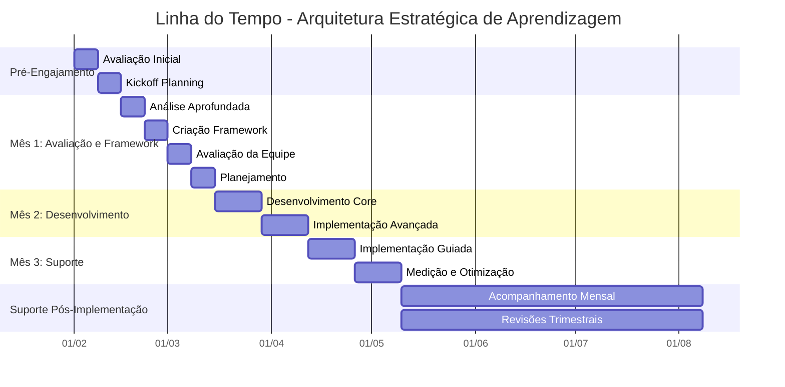

# Pacote de Arquitetura de Aprendizagem Estratégica: Conectando Visão e Realidade

## O que os Clientes Pensam que é o Problema

Executivos frequentemente acreditam que seu desafio principal é estratégico - precisam de uma estratégia de aprendizagem melhor, uma estrutura mais abrangente ou uma visão mais clara. Investem tempo e recursos significativos desenvolvendo estratégias e roteiros de aprendizagem elaborados, esperando que esses planos naturalmente se transformem em resultados.

## O Problema Real

O desafio central não está no planejamento estratégico - está na distância entre a visão estratégica e a realidade do dia a dia. Muitas organizações têm estratégias de aprendizagem excelentes que falham na implementação porque:

* Planos estratégicos não consideram restrições práticas
* A visão executiva não se traduz em realidade operacional
* A alocação de recursos não corresponde às necessidades de implementação
* As estruturas de medição não capturam o impacto real
* A comunicação falha entre os níveis

## Como Este Pacote Resolve

Em vez de criar outra estratégia teórica, ajudamos executivos a construir arquiteturas de aprendizagem que funcionam na prática. Por meio de workshops mensais e revisões trimestrais, nós:

Atividades Principais:

* Conectamos visão estratégica à realidade da implementação
* Construímos modelos de recursos baseados em necessidades reais
* Criamos estruturas práticas de medição
* Desenvolvemos sistemas de comunicação funcionais
* Ajustamos estratégias com base no retorno da implementação

O engajamento inicial de dois meses concentra-se em construir uma ponte entre a visão estratégica e a realidade operacional, garantindo que as estratégias de aprendizagem entreguem resultados.

# Pacote de Arquitetura de Aprendizagem Estratégica

## Plano Abrangente de Entrega

## Fase Pré-Engajamento

### Avaliação Inicial (Semana 0)

Nosso engajamento começa antes da data oficial de início. Durante esta fase, conduzimos uma avaliação completa para entender o estado atual da sua organização e prontidão para implementação.

Atividades:

Começamos com uma avaliação organizacional detalhada cobrindo capacidades de implementação, dinâmicas de equipe e abordagens atuais de aprendizagem. Isto inclui revisão de documentação existente, entrevistas com partes interessadas e análise de tentativas anteriores de implementação. Prestamos atenção particular ao entendimento tanto dos sucessos quanto das falhas em suas iniciativas de aprendizagem.

Entregas:

* Relatório de Prontidão Organizacional
* Avaliação de Capacidade de Implementação
* Documento de Análise de Riscos
* Mapa de Alinhamento das Partes Interessadas

### Planejamento Inicial (Semana 0)

Antes de começar o engajamento formal, estabelecemos expectativas claras e alinhamento com todas as partes interessadas.

Atividades:

Conduzimos sessões de planejamento com as principais partes interessadas para estabelecer metas, definir métricas de sucesso e criar protocolos de comunicação. Compartilhamos nossa metodologia completa, incluindo desafios potenciais que antecipamos com base em nossa experiência com implementações similares.

Entregas:

* Termo de Abertura do Projeto Detalhado
* Estrutura de Métricas de Sucesso
* Plano de Comunicação
* Estratégia de Mitigação de Riscos

## Mês 1: Avaliação e Desenvolvimento da Estrutura

### Semana 1: Análise Aprofundada

Começamos com um exame intensivo do contexto de implementação de aprendizagem da sua organização.

Atividades:

* Realizamos entrevistas detalhadas com membros da equipe em todos os níveis
* Revisamos iniciativas de aprendizagem existentes e seus resultados
* Analisamos infraestrutura técnica e capacidades
* Examinamos processos de implementação atuais

Entregas:

* Análise Abrangente da Situação
* Avaliação da Infraestrutura Técnica
* Análise de Lacunas de Processo
* Relatório Inicial de Recomendações

### Semana 2: Criação da Estrutura

Com base em nossa análise, desenvolvemos uma estrutura de implementação personalizada.

Atividades:

* Projetamos processos de implementação adaptados ao seu contexto
* Criamos modelos de documentação e ferramentas
* Desenvolvemos mecanismos de acompanhamento
* Estabelecemos ciclos de feedback

Entregas:

* Estrutura de Implementação Personalizada
* Documentação de Processos
* Conjunto de Ferramentas
* Projeto do Sistema de Medição

### Semana 3: Avaliação de Capacidade da Equipe

Avaliamos as capacidades atuais da sua equipe e desenvolvemos planos de aprimoramento.

Atividades:

* Avaliamos capacidades individuais e da equipe
* Identificamos lacunas de habilidades e necessidades de desenvolvimento
* Criamos trilhas de aprendizagem para membros da equipe
* Projetamos programas de construção de capacidades

Entregas:

* Relatório de Avaliação de Capacidades
* Planos de Desenvolvimento Individual
* Estratégia de Aprimoramento da Equipe
* Projeto do Programa de Treinamento

### Semana 4: Planejamento da Implementação

Finalizamos a abordagem de implementação e preparamos para execução.

Atividades:

Criamos uma linha do tempo detalhada de implementação, atribuímos papéis e responsabilidades, estabelecemos uma estrutura de governança e configuramos sistemas de monitoramento. Este planejamento cuidadoso garante que cada aspecto da implementação tenha um responsável claro e um caminho definido para o sucesso.

Entregas:

* Roteiro de Implementação
* Matriz RACI (Responsável, Autoridade, Consultado, Informado)
* Estrutura de Governança
* Painel de Monitoramento

## Mês 2: Construção de Capacidade da Equipe

### Semanas 5-6: Desenvolvimento de Habilidades Fundamentais

Concentramos nossos esforços na construção de capacidades essenciais de implementação. Nesta fase, trabalhamos intensivamente com a equipe para desenvolver as habilidades necessárias para uma implementação bem-sucedida.

Atividades:

Realizamos workshops práticos de desenvolvimento de habilidades, proporcionamos sessões de prática hands-on, implementamos mecanismos de feedback e iniciamos implementações em pequena escala. Esta abordagem prática permite que a equipe aprenda fazendo, sob orientação especializada.

Entregas:

* Relatórios de Desenvolvimento de Habilidades
* Resultados das Sessões Práticas
* Análise de Feedback
* Resultados Iniciais da Implementação

### Semanas 7-8: Treinamento Avançado de Implementação

Avançamos para cenários de implementação mais complexos, preparando a equipe para desafios mais sofisticados.

Atividades:

Conduzimos workshops de implementação avançada, orientamos o tratamento de cenários complexos, desenvolvemos capacidades de resolução de problemas e aprimoramos habilidades de tomada de decisão. Esta fase aprofunda o conhecimento da equipe e fortalece sua capacidade de lidar com situações desafiadoras.

Entregas:

* Relatório de Capacidades Avançadas
* Guia de Resolução de Cenários
* Estrutura de Resolução de Problemas
* Modelo de Matriz de Decisão

## Mês 3: Suporte à Implementação e Medição

### Semanas 9-10: Implementação Guiada

Nesta fase crucial, apoiamos a equipe durante implementações reais, oferecendo orientação em tempo real. Nossa presença constante garante que a equipe possa aplicar o conhecimento adquirido com confiança.

Atividades:

* Supervisionamos projetos de implementação
* Fornecemos coaching em tempo real
* Tratamos desafios emergentes
* Ajustamos abordagens com base nos resultados

Entregas:

* Relatórios de Progresso da Implementação
* Resumos das Sessões de Coaching
* Registro de Resolução de Desafios
* Recomendações de Ajustes

### Semanas 11-12: Medição e Otimização

Durante este período final do terceiro mês, concentramos nossos esforços na análise de resultados e refinamento de processos. Esta fase é fundamental para garantir que as melhorias implementadas sejam sustentáveis.

Atividades:

* Coletamos e analisamos dados de implementação
* Medimos sucesso em relação aos indicadores-chave
* Identificamos oportunidades de otimização
* Refinamos processos com base no aprendizado

Entregas:

* Relatório de Análise de Desempenho
* Resumo de Alcance dos Indicadores-chave
* Recomendações de Otimização
* Documentação de Processos Refinada

## Suporte Pós-Implementação

### Suporte Contínuo (Meses 4-6)

Fornecemos suporte continuado para garantir o sucesso sustentável. Esta fase é essencial para consolidar as mudanças e garantir que a organização mantenha seu momento de transformação.

Atividades:

* Realizamos verificações mensais
* Revisamos o progresso da implementação
* Tratamos desafios emergentes
* Orientamos a melhoria contínua

Entregas:

* Relatórios Mensais de Progresso
* Atualizações de Resolução de Desafios
* Recomendações de Melhoria
* Documentação de Casos de Sucesso

## Elementos-Chave para o Sucesso

### Padrões de Documentação

Ao longo do engajamento, mantemos documentação abrangente que serve como referência futura e ferramenta de aprendizado para toda a organização:

* Todos os processos são documentados com fundamentação clara
* Decisões são registradas com contexto e raciocínio
* Desafios e soluções são registrados para referência futura
* Casos de sucesso e falhas são documentados para aprendizado

### Protocolo de Comunicação

Estabelecemos canais de comunicação claros para garantir transparência e alinhamento constante:

* Atualizações semanais de status para todas as partes interessadas
* Disponibilidade diária para questões urgentes
* Sessões regulares de feedback
* Relato transparente de problemas

### Estrutura de Medição

Acompanhamos o sucesso através de múltiplas métricas que nos permitem avaliar o progresso de forma abrangente:

* Taxas de sucesso da implementação
* Crescimento da capacidade da equipe
* Melhorias na eficiência dos processos
* Métricas de impacto nos negócios

### Gestão de Riscos

Mantemos gestão ativa de riscos para antecipar e mitigar possíveis obstáculos:

* Atualizações semanais da avaliação de riscos
* Estratégias proativas de mitigação
* Procedimentos claros de escalonamento
* Sessões regulares de revisão de riscos

## Propostas Únicas de Valor

### Compromisso com Transparência

Demonstramos nosso compromisso com a transparência através de práticas consistentes:

* Compartilhamento de nossa metodologia completa
* Discussão tanto de sucessos quanto de falhas
* Visibilidade clara do progresso
* Comunicação aberta sobre desafios

### Foco Prático

Garantimos valor prático através de uma abordagem baseada em resultados:

* Prática de implementação no mundo real
* Construção prática de capacidades
* Execução real de projetos
* Resultados mensuráveis

### Transferência de Conhecimento

Facilitamos a transferência completa de conhecimento por meio de:

* Documentação abrangente
* Workshops de desenvolvimento de habilidades
* Prática hands-on
* Suporte contínuo

_Este plano de entrega foi projetado para ser adaptável com base nas necessidades organizacionais, mantendo elementos fundamentais que garantem o sucesso da implementação._

