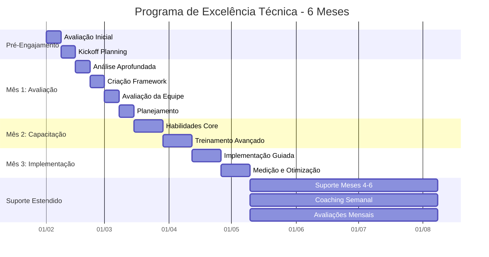

# Programa de Excelência Técnica: Construindo Capacidade Real de Implementação

## O que os Clientes Pensam que é seu Problema

Equipes técnicas frequentemente consideram que seu principal desafio é o desenvolvimento de habilidades técnicas - precisam de mais treinamento, melhores ferramentas ou técnicas mais avançadas. Concentram-se em adquirir mais conhecimento técnico, acreditando que isso resolverá seus desafios de implementação.

## O Problema Real

O desafio fundamental não é o conhecimento técnico - é a capacidade de aplicar esse conhecimento de forma eficaz em contextos organizacionais complexos. Equipes técnicas enfrentam dificuldades com:

- Adaptação de abordagens técnicas às realidades organizacionais
- Gerenciamento das expectativas e resistência das partes interessadas
- Tradução de conceitos técnicos para públicos não técnicos
- Construção de processos sustentáveis de implementação
- Medição e comunicação do impacto técnico

## Como este Pacote Resolve o Problema

Em vez de apenas adicionar mais conhecimento técnico, ajudamos as equipes a desenvolverem capacidade prática de implementação através de experiência prática. Durante seis meses, nós:

Atividades Principais:

- Trabalhamos em projetos reais de implementação
- Construímos habilidades práticas de aplicação
- Desenvolvemos capacidades de gestão de stakeholders
- Criamos abordagens eficazes de comunicação
- Estabelecemos sistemas de medição

O acompanhamento semanal garante o desenvolvimento contínuo de habilidades, enquanto avaliações mensais monitoram o progresso e ajustam os caminhos de desenvolvimento com base nas necessidades reais.

## Plano Abrangente de Entrega

## Fase Pré-Engajamento

### Avaliação Inicial (Semana 0)

Nosso engajamento começa antes da data oficial de início. Durante esta fase, realizamos uma avaliação completa para entender o estado atual e a prontidão da sua organização para implementação.

Atividades:

Começamos com uma avaliação organizacional detalhada cobrindo capacidades de implementação, dinâmica de equipe e abordagens atuais de aprendizagem. Isso inclui revisão da documentação existente, condução de entrevistas com stakeholders e análise de tentativas anteriores de implementação. Prestamos atenção especial para compreender tanto os sucessos quanto as falhas em suas iniciativas de aprendizagem.

Entregas:

- Relatório de Prontidão Organizacional
- Avaliação de Capacidade de Implementação
- Documento de Análise de Riscos
- Mapa de Alinhamento de Stakeholders

### Planejamento de Início (Semana 0)

Antes de iniciar o engajamento formal, estabelecemos expectativas claras e alinhamento com todos os stakeholders.

Atividades:

Conduzimos sessões de planejamento com stakeholders principais para estabelecer objetivos, definir métricas de sucesso e criar protocolos de comunicação. Compartilhamos nossa metodologia completa, incluindo possíveis desafios que antecipamos com base em nossa experiência com implementações similares.

Entregas:

- Relatório Detalhado do Projeto
- Estrutura de Métricas de Sucesso
- Plano de Comunicação
- Estratégia de Mitigação de Riscos

## Mês 1: Avaliação e Desenvolvimento da Estrutura

### Semana 1: Análise Aprofundada

Iniciamos com um exame intensivo do contexto de implementação de aprendizagem da sua organização.

Atividades:

- Conduzimos entrevistas detalhadas com membros da equipe em todos os níveis
- Revisamos iniciativas de aprendizagem existentes e seus resultados
- Analisamos infraestrutura e capacidades técnicas
- Examinamos processos atuais de implementação

Entregas:

- Análise Abrangente da Situação
- Avaliação da Infraestrutura Técnica
- Análise de Lacunas de Processo
- Relatório Inicial de Recomendações

### Semana 2: Criação da Estrutura

Com base em nossa análise, desenvolvemos uma estrutura de implementação personalizada.

Atividades:

- Projetamos processos de implementação adaptados ao seu contexto
- Criamos modelos e ferramentas de documentação
- Desenvolvemos mecanismos de acompanhamento
- Estabelecemos ciclos de feedback

Entregas:

- Estrutura de Implementação Personalizada
- Documentação de Processos
- Conjunto de Ferramentas
- Projeto do Sistema de Medição

### Semana 3: Avaliação de Capacidade da Equipe

Avaliamos as capacidades atuais da sua equipe e desenvolvemos planos de aprimoramento.

Atividades:

- Avaliamos capacidades individuais e da equipe
- Identificamos lacunas de habilidades e necessidades de desenvolvimento
- Criamos caminhos de aprendizagem para membros da equipe
- Projetamos programas de construção de capacidade

Entregas:

- Relatório de Avaliação de Capacidade
- Planos de Desenvolvimento Individual
- Estratégia de Aprimoramento da Equipe
- Projeto do Programa de Treinamento

### Semana 4: Planejamento da Implementação

Finalizamos a abordagem de implementação e preparamos para execução.

Atividades:

- Criamos cronograma detalhado de implementação
- Atribuímos funções e responsabilidades
- Estabelecemos estrutura de governança
- Configuramos sistemas de monitoramento

Entregas:

- Roteiro de Implementação
- Matriz RACI
- Estrutura de Governança
- Painel de Monitoramento

## Mês 2: Construção de Capacidade da Equipe

### Semanas 5-6: Desenvolvimento de Habilidades Fundamentais

Concentramos no desenvolvimento de capacidades essenciais de implementação.

Atividades:

- Conduzimos oficinas de desenvolvimento de habilidades
- Fornecemos sessões práticas
- Implementamos mecanismos de feedback
- Iniciamos implementações em pequena escala

Entregas:

- Relatórios de Desenvolvimento de Habilidades
- Resultados das Sessões Práticas
- Análise de Feedback
- Resultados Iniciais de Implementação

### Semanas 7-8: Treinamento Avançado de Implementação

Avançamos para cenários mais complexos de implementação.

Atividades:

- Lideramos oficinas avançadas de implementação
- Orientamos o tratamento de cenários complexos
- Desenvolvemos capacidades de resolução de problemas
- Aprimoramos habilidades de tomada de decisão

Entregas:

- Relatório de Capacidade Avançada
- Guia de Resolução de Cenários
- Estrutura de Resolução de Problemas
- Modelo de Matriz de Decisão

## Mês 3: Suporte à Implementação e Medição

### Semanas 9-10: Implementação Guiada

Apoiamos a equipe durante implementações reais fornecendo orientação em tempo real.

Atividades:

- Supervisionamos projetos de implementação
- Fornecemos acompanhamento em tempo real
- Tratamos desafios emergentes
- Ajustamos abordagens com base nos resultados

Entregas:

- Relatórios de Progresso da Implementação
- Resumos das Sessões de Acompanhamento
- Registro de Resolução de Desafios
- Recomendações de Ajuste

### Semanas 11-12: Medição e Otimização

Concentramos em medir resultados e otimizar processos.

Atividades:

- Coletamos e analisamos dados de implementação
- Medimos sucesso em relação aos KPIs
- Identificamos oportunidades de otimização
- Refinamos processos com base no aprendizado

Entregas:

- Relatório de Análise de Desempenho
- Resumo de Alcance dos KPIs
- Recomendações de Otimização
- Documentação de Processos Refinada

## Suporte Pós-Implementação

### Suporte Contínuo (Meses 4-6)

Fornecemos suporte continuado para garantir sucesso sustentável.

Atividades:

- Realizamos verificações mensais
- Revisamos progresso da implementação
- Tratamos desafios emergentes
- Orientamos melhoria contínua

Entregas:

- Relatórios Mensais de Progresso
- Atualizações de Resolução de Desafios
- Recomendações de Melhoria
- Documentação de Casos de Sucesso

## Elementos-Chave para o Sucesso

### Padrões de Documentação

Durante todo o engajamento, mantemos documentação abrangente:

- Todos os processos são documentados com fundamentação clara
- Decisões são registradas com contexto e raciocínio
- Desafios e soluções são registrados para referência futura
- Casos de sucesso e falhas são documentados para aprendizado

### Protocolo de Comunicação

Estabelecemos canais claros de comunicação:

- Atualizações semanais de status para todos os stakeholders
- Disponibilidade diária para questões urgentes
- Sessões regulares de feedback
- Relato transparente de problemas

### Estrutura de Medição

Monitoramos o sucesso através de múltiplas métricas:

- Taxas de sucesso da implementação
- Crescimento da capacidade da equipe
- Melhorias na eficiência dos processos
- Métricas de impacto nos negócios

### Gestão de Riscos

Mantemos gestão ativa de riscos:

- Atualizações semanais da avaliação de riscos
- Estratégias proativas de mitigação
- Procedimentos claros de escalonamento
- Sessões regulares de revisão de riscos

## Propostas Únicas de Valor

### Compromisso com Transparência

Demonstramos nosso compromisso com transparência:

- Compartilhando nossa metodologia completa
- Discutindo tanto sucessos quanto falhas
- Fornecendo visibilidade clara do progresso
- Mantendo comunicação aberta sobre desafios

### Foco Prático

Garantimos valor prático através de:

- Prática de implementação no mundo real
- Construção prática de capacidades
- Execução real de projetos
- Resultados mensuráveis

### Transferência de Conhecimento

Facilitamos transferência completa de conhecimento via:

- Documentação abrangente
- Oficinas de desenvolvimento de habilidades
- Prática hands-on
- Suporte contínuo

_Este plano de entrega é projetado para ser adaptável com base nas necessidades organizacionais, mantendo elementos fundamentais que garantem o sucesso da implementação._

