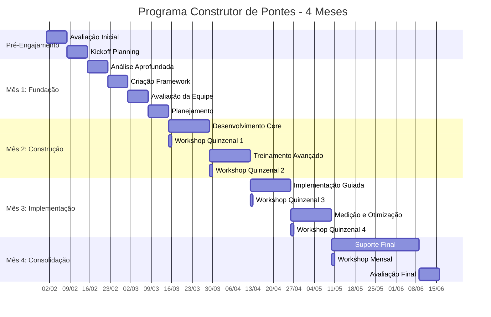

# Programa Construtor de Pontes: Criando Alinhamento Organizacional

## O Que os Clientes Pensam Ser o Problema

Organizações frequentemente acreditam que seu principal desafio é estrutural - precisam de processos melhores, hierarquias mais claras ou funções mais definidas. Investem em reorganizações e novas estruturas de reporte, esperando que essas mudanças melhorem a colaboração entre equipes técnicas e liderança.

## O Problema Real

O desafio central não é estrutural - é compreensão e comunicação. Equipes técnicas e executivos frequentemente operam em mundos diferentes, com:

* Linguagens e terminologias diferentes
* Prioridades e perspectivas diferentes
* Formas diferentes de medir sucesso
* Abordagens diferentes para resolução de problemas
* Visões diferentes sobre o que mais importa

## Como Este Pacote Resolve

Em vez de adicionar mais estrutura, ajudamos a construir entendimento real entre equipes técnicas e executivas. Por meio de sessões quinzenais e workshops mensais, nós:

Atividades Principais:

* Desenvolvemos compreensão e linguagem compartilhadas
* Criamos frameworks efetivos de comunicação
* Construímos processos colaborativos de tomada de decisão
* Estabelecemos métricas comuns de sucesso
* Fomentamos respeito e valorização mútuos

O programa de quatro meses concentra-se em criar pontes duradouras entre diferentes níveis organizacionais, garantindo que a colaboração efetiva continue muito após nosso engajamento terminar.

## Plano Abrangente de Entrega

## Fase Pré-Engajamento

### Avaliação Inicial (Semana 0)

Nosso engajamento começa antes da data oficial de início. Durante esta fase, conduzimos uma avaliação minuciosa para compreender o estado atual da sua organização e prontidão para implementação.

Atividades:

Começamos com uma avaliação organizacional detalhada cobrindo capacidades de implementação, dinâmicas de equipe e abordagens atuais de aprendizagem. Isso inclui revisão da documentação existente, condução de entrevistas com stakeholders e análise de tentativas anteriores de implementação. Prestamos atenção particular ao entendimento tanto dos sucessos quanto das falhas em suas iniciativas de aprendizagem.

Entregas:

* Relatório de Prontidão Organizacional
* Avaliação de Capacidade de Implementação
* Documento de Análise de Riscos
* Mapa de Alinhamento de Stakeholders

### Planejamento de Início (Semana 0)

Antes de começar o engajamento formal, estabelecemos expectativas claras e alinhamento com todos os stakeholders.

Atividades:

Conduzimos sessões de planejamento com stakeholders-chave para estabelecer objetivos, definir métricas de sucesso e criar protocolos de comunicação. Compartilhamos nossa metodologia completa, incluindo desafios potenciais que antecipamos com base em nossa experiência com implementações similares.

Entregas:

* Termo de Abertura do Projeto Detalhado
* Framework de Métricas de Sucesso
* Plano de Comunicação
* Estratégia de Mitigação de Riscos

## Mês 1: Avaliação e Desenvolvimento do Framework

### Semana 1: Análise Aprofundada

Começamos com um exame intensivo do contexto de implementação de aprendizagem da sua organização.

Atividades:

* Conduzir entrevistas detalhadas com membros da equipe em todos os níveis
* Revisar iniciativas de aprendizagem existentes e seus resultados
* Analisar infraestrutura técnica e capacidades
* Examinar processos atuais de implementação

Entregas:

* Análise Abrangente da Situação
* Avaliação da Infraestrutura Técnica
* Análise de Lacunas de Processo
* Relatório Inicial de Recomendações

### Semana 2: Criação do Framework

Com base em nossa análise, desenvolvemos um framework de implementação personalizado.

Atividades:

* Projetar processos de implementação adaptados ao seu contexto
* Criar templates de documentação e ferramentas
* Desenvolver mecanismos de acompanhamento
* Estabelecer loops de feedback

Entregas:

* Framework de Implementação Customizado
* Documentação de Processos
* Conjunto de Ferramentas
* Design do Sistema de Medição

### Semana 3: Avaliação de Capacidade da Equipe

Avaliamos as capacidades atuais da sua equipe e desenvolvemos planos de aprimoramento.

Atividades:

* Avaliar capacidades individuais e da equipe
* Identificar lacunas de habilidades e necessidades de desenvolvimento
* Criar caminhos de aprendizagem para membros da equipe
* Projetar programas de construção de capacidade

Entregas:

* Relatório de Avaliação de Capacidade
* Planos de Desenvolvimento Individual
* Estratégia de Aprimoramento da Equipe
* Design do Programa de Treinamento

### Semana 4: Planejamento da Implementação

Finalizamos a abordagem de implementação e preparamos para execução.

Atividades:

* Criar cronograma detalhado de implementação
* Atribuir papéis e responsabilidades
* Estabelecer estrutura de governança
* Configurar sistemas de monitoramento

Entregas:

* Roteiro de Implementação
* Matriz RACI
* Framework de Governança
* Dashboard de Monitoramento

## Mês 2: Construção de Capacidade da Equipe

### Semanas 5-6: Desenvolvimento de Habilidades Essenciais

Focamos na construção de capacidades essenciais de implementação.

Atividades:

* Conduzir workshops de construção de habilidades
* Fornecer sessões práticas hands-on
* Implementar mecanismos de feedback
* Iniciar implementações em pequena escala

Entregas:

* Relatórios de Desenvolvimento de Habilidades
* Resultados das Sessões Práticas
* Análise de Feedback
* Resultados Iniciais de Implementação

### Semanas 7-8: Treinamento Avançado de Implementação

Avançamos para cenários de implementação mais complexos.

Atividades:

* Liderar workshops avançados de implementação
* Orientar tratamento de cenários complexos
* Desenvolver capacidades de resolução de problemas
* Aprimorar habilidades de tomada de decisão

Entregas:

* Relatório de Capacidade Avançada
* Guia de Resolução de Cenários
* Framework de Resolução de Problemas
* Template de Matriz de Decisão

## Mês 3: Suporte à Implementação e Medição

### Semanas 9-10: Implementação Guiada

Apoiamos a equipe durante implementações reais fornecendo orientação em tempo real.

Atividades:

* Supervisionar projetos de implementação
* Fornecer coaching em tempo real
* Endereçar desafios emergentes
* Ajustar abordagens com base nos resultados

Entregas:

* Relatórios de Progresso da Implementação
* Resumos das Sessões de Coaching
* Registro de Resolução de Desafios
* Recomendações de Ajustes

### Semanas 11-12: Medição e Otimização

Focamos em medir resultados e otimizar processos.

Atividades:

* Coletar e analisar dados de implementação
* Medir sucesso contra KPIs
* Identificar oportunidades de otimização
* Refinar processos com base no aprendizado

Entregas:

* Relatório de Análise de Performance
* Resumo de Alcance de KPIs
* Recomendações de Otimização
* Documentação Refinada de Processos

## Suporte Pós-Implementação

### Suporte Contínuo (Meses 4-6)

Fornecemos suporte continuado para garantir sucesso sustentável.

Atividades:

* Conduzir check-ins mensais
* Revisar progresso da implementação
* Endereçar desafios emergentes
* Orientar melhoria contínua

Entregas:

* Relatórios Mensais de Progresso
* Atualizações de Resolução de Desafios
* Recomendações de Melhoria
* Documentação de Casos de Sucesso

## Elementos-Chave de Sucesso

### Padrões de Documentação

Durante todo o engajamento, mantemos documentação abrangente:

* Todos os processos são documentados com fundamentação clara
* Decisões são registradas com contexto e raciocínio
* Desafios e soluções são registrados para referência futura
* Casos de sucesso e falhas são documentados para aprendizado

### Protocolo de Comunicação

Estabelecemos canais claros de comunicação:

* Atualizações semanais de status para todos os stakeholders
* Disponibilidade diária para questões urgentes
* Sessões regulares de feedback
* Reporte transparente de problemas

### Framework de Medição

Acompanhamos sucesso através de múltiplas métricas:

* Taxas de sucesso de implementação
* Crescimento da capacidade da equipe
* Melhorias de eficiência de processo
* Métricas de impacto no negócio

### Gestão de Riscos

Mantemos gestão ativa de riscos:

* Atualizações semanais de avaliação de riscos
* Estratégias proativas de mitigação
* Procedimentos claros de escalação
* Sessões regulares de revisão de riscos

## Propostas Únicas de Valor

### Compromisso com Transparência

Demonstramos nosso compromisso com transparência através de:

* Compartilhamento de nossa metodologia completa
* Discussão tanto de sucessos quanto de falhas
* Fornecimento de visibilidade clara do progresso
* Manutenção de comunicação aberta sobre desafios

### Foco Prático

Garantimos valor prático através de:

* Prática de implementação no mundo real
* Construção hands-on de capacidade
* Execução real de projeto
* Resultados mensuráveis

### Transferência de Conhecimento

Facilitamos transferência completa de conhecimento via:

* Documentação abrangente
* Workshops de construção de habilidades
* Prática hands-on
* Suporte contínuo

_Este plano de entrega foi projetado para ser adaptável com base nas necessidades organizacionais enquanto mantém elementos centrais que garantem sucesso na implementação._

