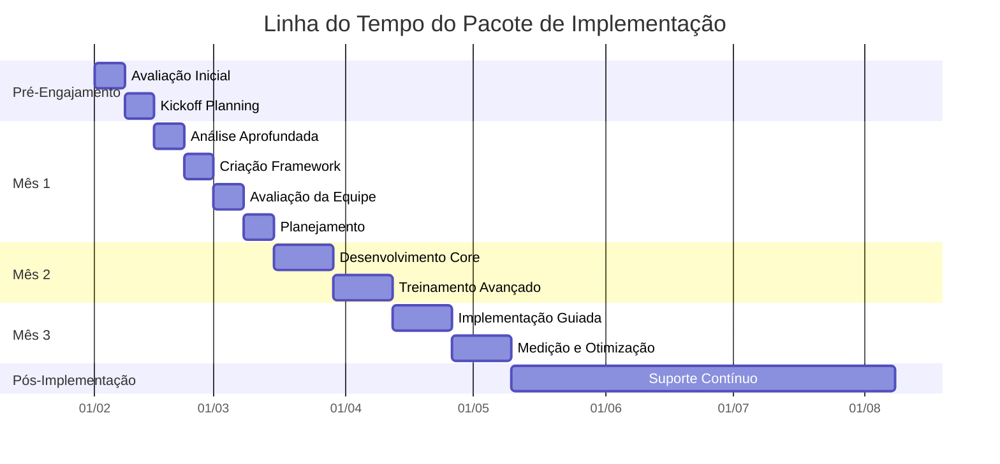

# Pacote de Inteligência de Implementação: Transformando Conhecimento em Ação

## O que os Clientes Pensam que é o Problema

Organizações frequentemente acreditam que seu principal desafio é encontrar o conteúdo de aprendizagem correto ou selecionar a plataforma de aprendizagem perfeita. Elas pensam que se tivessem um conteúdo melhor ou um LMS mais sofisticado, suas iniciativas de aprendizagem teriam sucesso. Muitas investiram pesadamente em bibliotecas de conteúdo e plataformas, mas ainda lutam para ver resultados.

## O Problema Real

O verdadeiro desafio não é conteúdo ou tecnologia - é implementação. As organizações têm acesso a mais conteúdo de aprendizagem de qualidade do que nunca, mas lutam com a realidade complexa de transformar esse conteúdo em mudança comportamental real. Elas enfrentam desafios ocultos de implementação como:

* Resistência da média gerência
* Mecanismos pouco claros de transferência de aprendizagem
* Aplicação inconsistente dos princípios de aprendizagem
* Falta de estruturas práticas de implementação
* Medição insuficiente do impacto real

## Como Este Pacote Resolve

Em vez de adicionar mais conteúdo ou tecnologia, trabalhamos junto com sua equipe para construir capacidade real de implementação. Compartilhamos nossas estruturas abertamente, mostrando exatamente como iniciativas de aprendizagem bem-sucedidas funcionam na prática. Através de sessões semanais de coaching, ajudamos sua equipe a:

Atividades Principais:

* Documentar desafios específicos de implementação em seu contexto
* Construir estruturas práticas para superar resistências
* Criar mecanismos claros de transferência de aprendizagem
* Desenvolver sistemas de medição que rastreiam impacto real
* Ajustar abordagens com base em resultados reais

O engajamento mínimo de três meses garante que vamos além de correções superficiais para abordar desafios fundamentais de implementação. Não apenas dizemos o que fazer - trabalhamos com sua equipe para construir capacidade duradoura de implementação.

## Plano Abrangente de Entrega

## Fase Pré-Engajamento

### Avaliação Inicial (Semana 0)

Nosso engajamento começa antes da data oficial de início. Durante esta fase, conduzimos uma avaliação completa para entender o estado atual e a prontidão da sua organização para implementação.

Atividades:

Começamos com uma avaliação organizacional detalhada cobrindo capacidades de implementação, dinâmicas de equipe e abordagens atuais de aprendizagem. Isso inclui revisão de documentação existente, condução de entrevistas com stakeholders e análise de tentativas anteriores de implementação. Prestamos atenção especial para entender tanto sucessos quanto falhas em suas iniciativas de aprendizagem.

Entregas:

* Relatório de Prontidão Organizacional
* Avaliação de Capacidade de Implementação
* Documento de Análise de Riscos
* Mapa de Alinhamento de Stakeholders

### Planejamento de Kickoff (Semana 0)

Antes de iniciar o engajamento formal, estabelecemos expectativas claras e alinhamento com todos os stakeholders.

Atividades:

Conduzimos sessões de planejamento com stakeholders-chave para estabelecer objetivos, definir métricas de sucesso e criar protocolos de comunicação. Compartilhamos nossa metodologia completa, incluindo desafios potenciais que antecipamos com base em nossa experiência com implementações similares.

Entregas:

* Project Charter Detalhado
* Estrutura de Métricas de Sucesso
* Plano de Comunicação
* Estratégia de Mitigação de Riscos

## Mês 1: Avaliação e Desenvolvimento de Framework

### Semana 1: Análise Aprofundada

Começamos com um exame intensivo do contexto de implementação de aprendizagem da sua organização.

Atividades:

* Conduzir entrevistas detalhadas com membros da equipe em todos os níveis
* Revisar iniciativas de aprendizagem existentes e seus resultados
* Analisar infraestrutura técnica e capacidades
* Examinar processos atuais de implementação

Entregas:

* Análise Abrangente da Situação
* Avaliação da Infraestrutura Técnica
* Análise de Gaps de Processo
* Relatório Inicial de Recomendações

### Semana 2: Criação de Framework

Com base em nossa análise, desenvolvemos um framework de implementação personalizado.

Atividades:

* Projetar processos de implementação adequados ao seu contexto
* Criar templates e ferramentas de documentação
* Desenvolver mecanismos de acompanhamento
* Estabelecer loops de feedback

Entregas:

* Framework de Implementação Customizado
* Documentação de Processos
* Suite de Ferramentas
* Design do Sistema de Medição

### Semana 3: Avaliação de Capacidade da Equipe

Avaliamos as capacidades atuais da sua equipe e desenvolvemos planos de aprimoramento.

Atividades:

* Avaliar capacidades individuais e da equipe
* Identificar gaps de habilidades e necessidades de desenvolvimento
* Criar trilhas de aprendizagem para membros da equipe
* Projetar programas de construção de capacidade

Entregas:

* Relatório de Avaliação de Capacidade
* Planos de Desenvolvimento Individual
* Estratégia de Aprimoramento da Equipe
* Design do Programa de Treinamento

### Semana 4: Planejamento de Implementação

Finalizamos a abordagem de implementação e preparamos para execução.

Atividades:

* Criar cronograma detalhado de implementação
* Atribuir papéis e responsabilidades
* Estabelecer estrutura de governança
* Configurar sistemas de monitoramento

Entregas:

* Roadmap de Implementação
* Matriz RACI
* Framework de Governança
* Dashboard de Monitoramento

## Mês 2: Construção de Capacidade da Equipe

### Semanas 5-6: Desenvolvimento de Habilidades Essenciais

Focamos na construção de capacidades essenciais de implementação.

Atividades:

* Conduzir workshops de construção de habilidades
* Fornecer sessões práticas hands-on
* Implementar mecanismos de feedback
* Iniciar implementações em pequena escala

Entregas:

* Relatórios de Desenvolvimento de Habilidades
* Resultados das Sessões Práticas
* Análise de Feedback
* Resultados Iniciais de Implementação

### Semanas 7-8: Treinamento Avançado de Implementação

Avançamos para cenários mais complexos de implementação.

Atividades:

* Liderar workshops avançados de implementação
* Guiar tratamento de cenários complexos
* Desenvolver capacidades de resolução de problemas
* Aprimorar habilidades de tomada de decisão

Entregas:

* Relatório de Capacidade Avançada
* Guia de Resolução de Cenários
* Framework de Resolução de Problemas
* Template de Matriz de Decisão

## Mês 3: Suporte à Implementação e Medição

### Semanas 9-10: Implementação Guiada

Apoiamos a equipe através de implementações reais enquanto fornecemos orientação em tempo real.

Atividades:

* Supervisionar projetos de implementação
* Fornecer coaching em tempo real
* Abordar desafios emergentes
* Ajustar abordagens com base em resultados

Entregas:

* Relatórios de Progresso de Implementação
* Sumários das Sessões de Coaching
* Log de Resolução de Desafios
* Recomendações de Ajuste

### Semanas 11-12: Medição e Otimização

Focamos em medir resultados e otimizar processos.

Atividades:

* Coletar e analisar dados de implementação
* Medir sucesso contra KPIs
* Identificar oportunidades de otimização
* Refinar processos com base no aprendizado

Entregas:

* Relatório de Análise de Performance
* Sumário de Alcance de KPIs
* Recomendações de Otimização
* Documentação Refinada de Processos

## Suporte Pós-Implementação

### Suporte Contínuo (Meses 4-6)

Fornecemos suporte continuado para garantir sucesso sustentável.

Atividades:

* Conduzir check-ins mensais
* Revisar progresso da implementação
* Abordar desafios emergentes
* Guiar melhoria contínua

Entregas:

* Relatórios Mensais de Progresso
* Atualizações de Resolução de Desafios
* Recomendações de Melhoria
* Documentação de Casos de Sucesso

## Elementos-Chave de Sucesso

### Padrões de Documentação

Durante todo o engajamento, mantemos documentação abrangente:

* Todos os processos são documentados com raciocínio claro
* Decisões são registradas com contexto e fundamentação
* Desafios e soluções são registrados para referência futura
* Casos de sucesso e falhas são documentados para aprendizado

### Protocolo de Comunicação

Estabelecemos canais claros de comunicação:

* Atualizações semanais de status para todos os stakeholders
* Disponibilidade diária para questões urgentes
* Sessões regulares de feedback
* Reporte transparente de problemas

### Framework de Medição

Rastreamos sucesso através de múltiplas métricas:

* Taxas de sucesso de implementação
* Crescimento de capacidade da equipe
* Melhorias de eficiência de processo
* Métricas de impacto no negócio

### Gestão de Riscos

Mantemos gestão ativa de riscos:

* Atualizações semanais de avaliação de riscos
* Estratégias proativas de mitigação
* Procedimentos claros de escalação
* Sessões regulares de revisão de riscos

## Proposições Únicas de Valor

### Compromisso com Transparência

Demonstramos nosso compromisso com transparência através de:

* Compartilhamento de nossa metodologia completa
* Discussão tanto de sucessos quanto falhas
* Fornecimento de visibilidade clara do progresso
* Manutenção de comunicação aberta sobre desafios

### Foco Prático

Garantimos valor prático através de:

* Prática de implementação no mundo real
* Construção hands-on de capacidade
* Execução real de projetos
* Resultados mensuráveis

### Transferência de Conhecimento

Facilitamos transferência completa de conhecimento via:

* Documentação abrangente
* Workshops de construção de habilidades
* Prática hands-on
* Suporte contínuo

_Este plano de entrega é projetado para ser adaptável com base nas necessidades organizacionais enquanto mantém elementos centrais que garantem sucesso na implementação._

