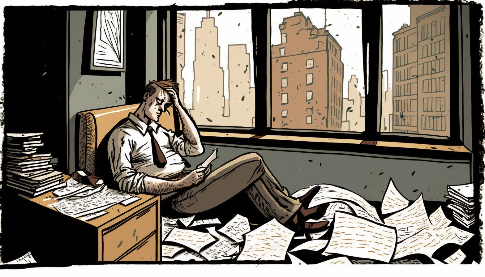

>[!example]- Comportamentos Inerciais
>
>1. [Introdução](Comportamentos%20Inerciais.md)
>2. [Impulsividade](Impulsividade.md)
>3. [Dependência excessiva](Dependência%20excessiva.md)
>4. [[Incapacidade de concentração]]
>5. [[Rigidez e inflexibilidade]]
>6. [[Dogmatismo]]
>7. [[Extrema falta de confiança]]
>8. [[Não apreender o sentido]]
>9. ➡️ [[Resistência ao pensamento]]

# Falta de disposição para pensar: Como o designer instrucional pode trabalhar esse comportamento

Muitas vezes nos deparamos com profissionais que parecem não ter a vontade de pensar e preferem que o líder esquematize tudo o que devem fazer. Eles não gostam de trabalhar de forma independente, projetar, discutir ou realizar pesquisas. Essas pessoas estão acostumadas a seguir os padrões de desempenho e acreditam que o líder deve ser o responsável pelo processo de pensamento, enquanto eles simplesmente fornecem as respostas certas, encontradas em manuais.

Um dos comportamentos mais comuns observados em profissionais que apresentam falta de disposição para pensar é a crença de que o chefe ou o líder deve ser responsável pelo processo de pensamento. Esses profissionais esperam que o líder esquematize tudo o que eles devem fazer, e só então irão executar as tarefas. Eles não gostam de trabalhar de forma independente, projetar, discutir ou realizar pesquisas, pois acreditam que o líder deve dar as respostas certas, encontradas em manuais.

Esse comportamento pode ser prejudicial para a equipe, uma vez que impede o desenvolvimento do pensamento crítico e da capacidade de resolver problemas de forma independente. Além disso, quando os profissionais não pensam por si mesmos, tornam-se menos engajados e produtivos, pois não estão conectados com o trabalho que estão realizando.

Infelizmente, esse tipo de comportamento pode levar a uma resistência à mudança e dificuldades em trabalhar em ambientes que exigem pensamento crítico. Então, como um designer instrucional pode trabalhar com esse comportamento?

O primeiro passo é oferecer várias oportunidades para esses profissionais experimentarem diferentes tipos de operações de pensamento. Eles precisam ser colocados em uma posição em que se espera que pensem e sejam encorajados a participar de atividades como interpretação, trabalho independente, hipóteses, obtenção de dados, classificação, imaginação, codificação, resumo e comparação.

Ao oferecer essas oportunidades e recompensá-los e informá-los de maneira adequada, esses profissionais podem ser orientados para uma mudança de comportamento. Se eles são encorajados a participar de atividades de pensamento diariamente por seis meses, há uma boa chance de que comecem a mudar a maneira como pensam e trabalham.

O papel do designer instrucional é fundamental nesse processo. Eles podem criar atividades que promovam o pensamento crítico e permitam que esses profissionais experimentem diferentes formas de pensamento. Além disso, é importante oferecer feedback constante e encorajamento positivo para motivá-los a continuar experimentando e aprendendo.

Outra estratégia eficaz é envolver esses profissionais em projetos desafiadores que exigem pensamento crítico e independência. Ao fazer isso, eles terão a oportunidade de aplicar as habilidades que estão aprendendo em situações reais e ver a importância do pensamento crítico no sucesso de um projeto.

É importante lembrar que a mudança de comportamento não acontece da noite para o dia. Requer tempo e dedicação para mudar a mentalidade e o comportamento. No entanto, com a orientação correta, o incentivo adequado e as oportunidades certas, é possível ajudar esses profissionais a se tornarem mais autônomos e capazes de pensamento crítico.

Em resumo, a falta de disposição para pensar é um comportamento que pode prejudicar o desempenho dos profissionais e a resistência à mudança. O designer instrucional pode trabalhar com esses profissionais, criando oportunidades para experimentar diferentes formas de pensamento e projetos desafiadores que exigem pensamento crítico e independência. Com a orientação correta, incentivo adequado e oportunidades certas, é possível ajudar esses profissionais a se tornarem mais autônomos e capazes de pensamento crítico.

> ➡️ [Operações de Pensamento](../../../Operações%20de%20Pensamento/Operações%20de%20Pensamento.md)

>[!abstract]- Design Para o Pensamento
>
>1. [Design Para o Pensamento](../Design%20Para%20o%20Pensamento.md)
>2. [Considerações sobre o D4T e suas Consequências](../Considerações%20sobre%20o%20D4T%20e%20suas%20Consequências.md)
>3. [Terminologia](../Terminologia.md)
>4. [Ambiente](../Dia%20a%20dia%20do%20Designer%20Instrucional/Ambiente.md)
>5. ➡️ [Comportamentos Inerciais](Comportamentos%20Inerciais.md)
>6. [Operações de Pensamento](../../../Operações%20de%20Pensamento/Operações%20de%20Pensamento.md)
>5. [Problema Central](../Dia%20a%20dia%20do%20Designer%20Instrucional/Problema%20Central.md)
>6. [Reuniões com SMEs](../Dia%20a%20dia%20do%20Designer%20Instrucional/Reuniões%20com%20SMEs.md)
>7. [Codificação de Conteúdo](../Dia%20a%20dia%20do%20Designer%20Instrucional/Codificação%20de%20Conteúdo.md)
>8. [Arco de aprendizagem](../Dia%20a%20dia%20do%20Designer%20Instrucional/Arco%20de%20aprendizagem.md)
>9. [Estudos de Caso](../../../Estudos%20de%20caso/Estudos%20de%20Caso.md)
>10. [Usando ADDIE com o D4T](../Dia%20a%20dia%20do%20Designer%20Instrucional/Usando%20ADDIE%20com%20o%20D4T.md)