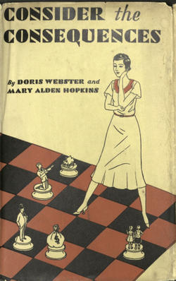

Os Cenários Ramificados são uma das mais eficientes e inovadoras formas de desenvolvimento de equipe, tendo surgido como livros-jogos desde 1930, com o romance interativo "_Considere as Consequências!"_, escrito por Doris Webster e Mary Alden Hopkins.

Desde então, essa ferramenta tem sido amplamente utilizada em diferentes meios, como a obra do escritor argentino Jorge Luis Borges, "Um Exame da Obra de Herbert Quain", e em séries infantis como "Aventuras Fantásticas" e "Escolha sua Aventura". Atualmente, a Netflix possui uma vasta biblioteca de [programas interativos](https://help.netflix.com/en/node/62526) que utilizam cenários ramificados..

Mas afinal, o que são os cenários ramificados? 

Cenários ramificados são soluções interativas que permitem aos usuários experimentar diferentes resultados a partir de uma série de decisões. Eles são comumente utilizados em treinamentos, simulações de negócios e decisões estratégicas. Os cenários ramificados são criados por designers instrucionais, que trabalham em conjunto com a equipe da empresa para entender suas necessidades e criar soluções personalizadas.

É importante lembrar que o desenvolvimento de um cenário ramificado exige a análise de três aspectos principais: a necessidade instrucional, a narrativa e o ponto de vista pragmático.

## Necessidade Instrucional

A primeira pergunta a ser feita ao desenvolver um cenário ramificado é se ele faz sentido para solucionar o problema em questão. Além disso, é importante definir o tipo de ramificação a ser utilizada.

## A Narrativa

Em seguida, é preciso avaliar se a meta do projeto instrucional permite a construção de uma narrativa que possa ser utilizada no desenvolvimento de uma solução por meio de cenários ramificados.

## O Ponto de Vista Pragmático

Por fim, é preciso verificar se há disponibilidade de orçamento, cronograma e equipe para o desenvolvimento de um cenário ramificado eficiente e completo.

Embora sejam populares entre designers instrucionais, clientes e alunos, os cenários ramificados ainda podem ser considerados difíceis de montar. No entanto, ao seguir os três aspectos acima mencionados, é possível garantir que o resultado seja satisfatório e impactante para o desenvolvimento da equipe.

# Os tipos de cenários ramificados

O primeiro livro interativo tinha 43 finais diferentes, então não é de hoje que cenários ramificados podem crescer sem controle. Basta o designer piscar os olhos e ele terá cenários demais para gerenciar, já que eles crescem em progressão geométrica.

Também é comum para clientes e especialistas no assunto acreditarem que cenários ramificados é uma sequência linear, com algumas respostas erradas para induzir os participantes ao erro e um orgulhoso botão "tente de novo".

Uma atividade de cenários ramificados bem desenvolvida é *só um pouquinho* mais sofisticada.

Entretanto, o envolvimento do cliente e dos demais especialistas no assunto podem transformar o desenvolvimento desses cenários em uma [confusão](https://www.christytuckerlearning.com/managing-the-complexity-of-branching-scenarios/?utm_source=pocket_reader).

O designer instrucional deve gerenciar um projeto de cenários ramificados muito bem, ou logo mais ele terá em mãos um prato **Código espaguete (Spaghetti code)** — isto é, um esqueleto de cenários com tantas setas que é preciso um time de DI para entender a relação entre tudo isso que está no papel e na cabeça das pessoas.

Para evitar esses problemas nos projetos de cenários ramificados, os designers instrucionais devem usar algum tipo de *framework*, um mapa para guiar seus esforços de análise e desenvolvimento (e as contribuições do cliente, especialistas, alunos, desenvolvedores ou qualquer pessoa envolvida no projeto).

E a principal habilidade para criar bons cenários ramificados é **saber contar uma boa história**.

## Cenários ramificados e a arte de contar histórias

Para criar bons cenários ramificados você precisa saber contar histórias. Entenda, não é preciso ser um bom "contador de causos", mas você precisa conhecer e compreender a estrutura para *contar uma história*, porque a principal ação dos participantes do cenário ramificado será **decidir** o que fazer. Para decidir você precisa de contexto. E para fornecer contexto, você precisa de uma história.

> [!warning] Cuidado!
> 
>Cenários ramificados não contém questões de certo ou errado, ou de colocar blocos na ordem certa: cenários tratam de **decisões e suas consequências**.

Se você decidiu que cenários ramificados é a solução certa, você já tem dois componentes essenciais para contar uma história:

1. **O tema**: A meta/objetivo que seu projeto instrucional resolverá.
2. **Os sub-temas**: por que as pessoas já não fazem isso? Por que é tão difícil?
3. **Os personages**: Seu público-alvo e tudo e todos com quem eles interagem.
4. **O final da história**: O que as pessoas precisam fazer para melhorar o desempenho.

Durante a fase de análise e design do [Fases do ADDIE](Fases%20do%20ADDIE.md), o designer instrucional, o cliente e os especialistas no assunto identificarão pontos cruciais em processos, ideias de melhoria e um monte de exemplos de ações, comportamentos, problemas, etc.

>[!Tip] Dica!
>
>Até mesmo um software pode ser um personagem, seja como herói da história ou como o antagonista. Nada impede que seu cenário instrucional seja uma comédia romântica entre um software e um hardware. Suas únicas limitações são a sua imaginação, o ambiente da empresa, a propriedade da solução com a meta estabelecida junto com o cliente e, é claro, o orçamento do projeto.

Você precisará organizar todas essas informações. Como fazer isso?

## Comportamento e Pensamento

Existem padrões de comportamento associados à incompletude ou inconsistência de pensamento. É útil identificar comportamentos que provavelmente se manifestariam com os profissionais que estavam tendo dificuldade em pensar. 

> [!todo] Depende de você!
> 
> Agora o designer instrucional precisa classificar todos os exemplos de dificuldades e desafios que ele, o cliente e o(s) especialista(s) no assunto identificaram. Assim você terá uma coleção de cenas e pontos de decisão que fazem sentido para colocar na história.

Esses comportamentos que se manifestam em decisões mal pensadas são:

**[Impulsividade](../D4T/Comportamentos%20Inerciais/Impulsividade.md)**: o comportamento dos alunos que "voam" na primeira sugestão, que pulam a arma, que, na verdade, não param para pensar.

**[Dependência excessiva](../D4T/Comportamentos%20Inerciais/Dependência%20excessiva.md)**: o padrão de precisar de ajuda em cada etapa de um processo, de ter dificuldade em trabalhar independentemente.

**[[../D4T/Comportamentos Inerciais/Incapacidade de concentração]]**: alguns alunos têm dificuldade em permanecer na tarefa. Má interpretação de fins e meios – um padrão de falha em reconhecer a ligação entre os passos atuais e os objetivos de longo prazo. Os professores muitas vezes veem os alunos com esse padrão como "impensados", como se não entendessem como as ações no "agora" contribuem para alcançar realizações futuras.

**[[../D4T/Comportamentos Inerciais/Rigidez e inflexibilidade]]**: um comportamento de não conseguir pensar fora da própria caixa do aluno; a tendência a repetir erros e a dificuldade de encontrar soluções alternativas.

**[[../D4T/Comportamentos Inerciais/Dogmatismo]]**: uma característica encontrada em pessoas que são superconfiantes em suas conclusões e que tentam forçá-las aos outros. O dogmatismo resiste à investigação.

**[[../D4T/Comportamentos Inerciais/Extrema falta de confiança]]**: um comportamento encontrado em alunos que são propensos a não participar da aula, que optam por não compartilhar suas opiniões com os outros por medo de serem envergonhados. Os professores veem os alunos com esse padrão como quietos e retraídos.

**[[../D4T/Comportamentos Inerciais/Não apreender o sentido]]**: um padrão de não conseguir ver os principais temas de parágrafos ou de relatórios. Alunos com esse tipo de dificuldade muitas vezes perdem o humor de piadas ou desenhos animados. Os alunos que tendem a perder o significado são aparentemente fracos na interpretação de contextos e situações.

**[[../D4T/Comportamentos Inerciais/Resistência ao pensamento]]**: Alguns alunos resistem a resolver problemas ou planejar. Sua atitude, expressa com frequência e com alguma estridência, é que os professores devem nos dizer o que fazer, e nós devemos fazê-lo. Eles tendem a ser orientados para a ação, "vamos fazer isso, sem toda a conversa".

Por que faremos essa classificação? Porque, à medida que os profissionais que exibem esses padrões comportamentais se envolvem em experiências de pensamento, seus maus hábitos em relação a pensar diminuirão.

> [!success] Fica a dica!
> 
>Decisão é o ponto central de cenários ramificados. Para decidir bem, o profissional precisa saber pensar sozinho.

Oportunidades para se envolver em **operações de pensamento** convida o profissional a amadurecer - principalmente aqueles com comportamentos que evidenciam dificuldade com o pensamento.

Agora que conseguimos todos os elementos do cenário, precisamos saber **contar a história**.

## Estrutura de cenários ramificados

Hoje é matematicamente improvável que alguém invente uma boa história completamente inédita. Adoramos é recontar nossas histórias, de novo e de novo. A principal delas é a **Jornada do Herói**, uma estrutura que serve a humanidade desde que aprendemos a contar histórias.

Um herói é um modelo. Ele personifica independentemente da virtude que determinada cultura entende como sagrado em determinado momento. As pessoas almejam copiar os comportamentos do herói. 

>[!Tip] Atenção:
>
> **Toda história tem um protagonista e um antagonista.** Quando concordamos com os valores do protagonista, ele é um herói. Quando não concordamos, ele é um anti-herói. O conflito entre eles move a história. Um bom cenário ramificado precisa ter uma boa história.

As teorias pedagógicas são importantes para entender as necessidades de aprendizado no projeto. Contudo, o designer instrucional precisa conhecer elementos de *storytelling* usados na literatura, cinema e televisão para criar cenários ramificados interessantes - áreas que possuem os conhecimento e as habilidades para *contar histórias*.

O framework abaixo serve como referência para *contar a história* em um cenário ramificado:

- Ele é dividido em 4 atos. 
- O cenário ramificado precisa abordar cada um deles. 
- A abordagem pode ser linear, com cada ramificação abordando um ato ou sequência. 
- Entretanto, normalmente, ela acontece de forma não linear e simultânea dentro das ramificações.

Na maioria dos projetos, os cenários, pontos de decisão, alternativas, todos os elementos abordam uma ou mais sequências simultaneamente.

O Ato 4 é o primeiro a ser desenvolvido, porque é nele que acontece os novos processos/comportamentos que a meta ou objetivo do projeto deseja atingir.

Depois, todos aqueles pontos cruciais em processos, ideias de melhoria e um monte de exemplos de ações, comportamentos, problemas, etc., começam a ganhar forma nos demais atos e como eles se relacionam entre si no cenário.

# Framework para Branching Scenario

Simplificando, os cenários ramificados são histórias que usam o conteúdo de aprendizagem, mas dependem das ações tomadas por um aluno. Eles desafiam o profissional a tomar decisões e, em seguida, representam as consequências resultantes com base na ação que foi tomada.

>[!info] Tema: 
>
>A questão que precisa ser resolvida pelo cenário ramificado para atingir a meta ou objetivo do projeto instrucional definidas pelo designer instrucional, o cliente e o especialista no assunto.

## Ato 1: Introdução do Personagem e Contexto

No primeiro ato, conhecemos o personagem principal e aprendemos sobre o contexto dos eventos subsequentes. Vejamos como ele normalmente lidam com problemas, o que revela uma falha ou algo faltante em sua vida. Este é também o momento em que entendemos os valores que são importantes para ele.

Lembre-se de que, mesmo no início da história, o personagem deve estar em busca de algum objetivo em cada cena. Muitas histórias fracassam porque o escritor não consegue introduzir conflito logo no início, recorrendo apenas a explicações sobre o personagem. O primeiro ato é uma oportunidade de mostrar o que é importante para o personagem principal.

>[!info] Info
>
>A estratégia de "Deixemos Tudo Como Está" pode parecer uma solução fácil e confortável para muitos problemas. No entanto, é importante considerar todas as implicações e consequências antes de adotá-la. Aqui, exploraremos os aspectos da estratégia, desde o protagonista da história até as consequências finais.

### Sequência 1 - O personagem irresistível

>[!info] Info
>
>A história começa com um protagonista sedutor (o aluno), apresentado com suas forças, fraquezas, rotinas e regras do mundo que vive. No entanto, ao longo da trama, ele é desafiado por um evento que o obriga a tomar uma decisão importante.

1. O GANCHO: Última coisa que você escreverá, essa sentença resumirá toda a história do cenário.
2. Introdução do protagonista: o participante é o protagonista da história. Nessa parte você mostra suas forças, seus pontos fracos, as rotinas e regras do mundo da história.
3. ÍMPETO - O evento que impulsiona o protagonista ao *conflito* e precisa de uma resposta. Normalmente é uma oportunidade ou uma ameaça.

### Sequência 2 - O que está em jogo

>[!info] Info
>
>Antes de decidir, o protagonista (o aluno) tenta negar a realidade da situação. No entanto, é preciso considerar os riscos pessoais, profissionais e financeiros envolvidos. Em seguida, o protagonista (lembre-se, o aluno) é confrontado com um dilema dramático, que exige uma escolha tangível entre aceitar ou recusar a oportunidade.

4. O protagonista negocia: o primeiro passo é negar a realidade. Qualquer coisa para manter o *status quo*.
5. Estabeleça os riscos agora: seja o risco pessoal, monetário, profissional e qualquer objeção deve ser identificada.
6. DILEMA DRAMÁTICO: A pergunta prática e tangível (sim ou não) sobre o objetivo do protagonista. Mostre a oportunidade, a recusa e aceitação relutante (normalmente é por motivos individualista ou egoístas).

### Ato 2: O Impetus

De repente, o mundo é desequilibrado, seja por uma ameaça ou por uma oportunidade. Isso pode ser o problema que o personagem precisa resolver para obter o que deseja. Seja uma ameaça à Terra, um meteoro em rota de colisão, uma família que perderá sua casa, uma bruxa na floresta ou um alienígena a bordo da nave.

Ou, em vez disso, pode ser uma oportunidade que desequilibra o mundo do personagem: encontrar uma bolsa de dinheiro, uma nova oferta de emprego, a localização do Arca da Aliança, ou uma experiência que muda a forma como o personagem enxerga o mundo.

Seja uma ameaça ou uma oportunidade, o impetus apresenta um problema que o personagem principal precisa resolver para alcançar seu objetivo.

>[!info] Info
>
>A primeira etapa da estratégia é tentar resolver o problema com suas próprias forças. No entanto, logo o protagonista se depara com uma primeira complicação, que parece ter uma solução. Infelizmente, essa solução se revela insuficiente, e o protagonista é levado a uma atitude ousada para tentar resolver o problema.

### Sequência 3 - Vencendo com suas próprias forças

7. SUB-TEMA — 1ª complicação: essa é uma armadilha que estamos armando para ele falhar mais tarde na 2ª complicação.
8. Personagem enfrenta a complicação. 
9. Aparente solução para a complicação.

### Sequência 4 - Rolando ladeira abaixo

>[!info] Info
>
>Apesar de sua coragem, a solução aparentemente eficaz se revela uma falha. O protagonista é forçado a enfrentar uma segunda complicação, muito mais desafiadora do que a primeira. Sem opções viáveis, ele recorre a medidas desesperadas para tentar resolver a situação.

10. Assumindo o risco como um cavaleiro!
11. Atitude ousada para resolver o problema.
12. MIDPOINT — Falso clímax (desilusão); nenhum truque ou tática é suficiente para resolver o desafio.

## Ato 3: Estabelecendo as Consequências

No Ato 3, as consequências da escolha feita pelo personagem principal são estabelecidas. Neste ato, vemos as consequências das ações do personagem principal e como elas afetam sua jornada para alcançar seu objetivo. É aqui que as coisas começam a ficar sérias, e as pressões sobre o personagem principal aumentam ainda mais.

Ao longo deste ato, o personagem principal enfrenta desafios e obstáculos ainda maiores em sua busca pelo objetivo. Eles precisam lidar com as consequências de suas ações e tomar decisões difíceis para avançar na jornada. É neste ponto que a tensão e a tensão do enredo atingem seu pico, e o público é mantido em suspense sobre o que vai acontecer a seguir.

Além disso, o Ato 3 também é o momento em que o personagem principal é obrigado a repensar sua abordagem para resolver o problema e atingir seu objetivo. Eles precisam encontrar maneiras de superar os obstáculos e ultrapassar as consequências de suas ações. Esta seção é crucial para o desenvolvimento da história e ajuda a construir a tensão emocional que leva o público a se envolver com o enredo.

### Sequência 5 - Consequências do Ato 2

>[!info] Info
>
>Infelizmente, as medidas desesperadas só pioram a situação. O protagonista se encontra em uma posição ainda mais vulnerável e precisa encontrar uma solução rápida. No final, ele é forçado a enfrentar as consequências de suas escolhas e aprender a lição valiosa.

13. SUB-TEMA — 2º complicação: armadilha propriamente dita!
14. O protagonista usa a mesma tática do n.º 8.
15. A solução para o n.º9 se revela uma falha.

### Sequência 6 - Seu ponto fraco quebra sua alma

16. Medidas desesperadas. Nesse ponto vale tudo para reverter a situação.
17. Confronto frenético. O protagonista age sem pensar.
18. FUNDO DO POÇO — Tudo está perdido, sabotado pelas suas fraquezas.

## Ato 4: Abraçando a Verdade Emocional

Em todas as histórias, o problema é o ponto central da trama. É o obstáculo que o personagem principal precisa superar para atingir seu objetivo e ter um final feliz. No entanto, muitas vezes, a verdade emocional que se esconde por trás desse problema é o que realmente importa. É isso que dá sentido à jornada do personagem e faz com que a história seja significativa e tocante para o público.

O Ato 4 é justamente sobre esse momento de descoberta e aceitação da verdade emocional. É a parte da história onde tudo se conecta e tudo faz sentido. O personagem principal enfim compreende o que realmente importa e isso muda tudo para ele ou ela.

Esse momento de aceitação pode ser emocionante, mas também pode ser desafiador. É possível que o personagem precise enfrentar suas próprias inseguranças e medos para chegar a essa verdade emocional. É possível também que ele ou ela precise tomar decisões difíceis ou correr riscos para abraçá-la.

Mas, independentemente dos obstáculos, é nesse momento que o personagem se torna mais forte e encontra um sentido mais profundo em sua jornada. É nesse momento que o personagem aprende a lição mais importante e encontra a paz interior.

O Ato 4 é, portanto, um momento crucial na construção da história e no desenvolvimento do personagem. É a parte da história que faz com que ela seja mais do que apenas uma série de eventos aleatórios e sem sentido. É a parte da história que faz com que ela se torne verdadeiramente significativa e impactante para o público.

>[!info] Info
>
>No final, o protagonista (o aluno) da história aprende que a estratégia "deixemos tudo como está" não é a melhor abordagem para encarar os desafios profissionais. Ele precisa tomar decisões audaciosas e enfrentar suas próprias fraquezas para alcançar o sucesso. É preciso sair da zona de conforto, arriscar e estar sempre preparado para lidar com as consequências de nossas escolhas.

### Sequência 7 - Reconhecer seus pontos fracos.

19. Nova perspectiva: Aqui a solução para o problema aparece como estratégia final. É o momento de reunir as forças para resolver a situação.
20. Lançar o ataque: as necessidades da solução substituem todas as vontades individuais (pontos-fracos), o protagonista enfrenta todos os medos. As mentiras são reveladas. 
21. CLÍMAX — O resultado irreversível e radical que revela a dura realidade. 

### Sequência 8 - Celebrando o novo mundo

>[!info] Info
>
>No final, o protagonista (o aluno) entende que caminho é diferente, talvez até o oposto do comportamento padrão até então. É importante o aluno compreender que, com determinação e perspicácia, é possível superar o obstáculo e alcançar os objetivos.

22. O personagem mostra amadurecimento, as suas falhas são resolvidas.
23. Nova rotina com as novas soluções, a celebração da vitória
24. NOVO MUNDO: como as coisas serão diferentes a partir de agora.

# Vale a pena criar cenários ramificados?

Então, os cenários ramificados valem o trabalho?

Quando eles são a melhor solução para um problema, possuem o tempo, orçamento e equipe para o desenvolvimento, os cenários ramificados valem cada centavo.

A questão é identificar a sua correta utilização.

Quando se trata de solucionar problemas empresariais, é importante considerar todas as opções disponíveis antes de decidir por uma abordagem específica. Em alguns casos, cenários ramificados podem ser a melhor escolha, mas isso depende de uma série de fatores.

Infelizmente, muitos projetos de **design instrucional** não passam pela fase de análise corretamente. Isso resulta em soluções erradas para os desafios apresentados e, consequentemente, em projetos de cenários ramificados fracassados. Além disso, é comum que empresas não possuam recursos suficientes para garantir um bom desenvolvimento desses cenários, seja por falta de orçamento, tempo ou equipe capacitada.

Para garantir o sucesso dos cenários ramificados, é fundamental investir na análise correta dos desafios apresentados e na equipe competente para desenvolvê-los. Além disso, é preciso avaliar se há orçamento e tempo suficiente para o desenvolvimento de soluções de qualidade.

## Perguntas Frequentes sobre Cenários Ramificados no Design Instrucional

1.  Quais são os principais fatores para o sucesso dos cenários ramificados no **design instrucional**? 
	1. Resposta: Análise correta dos desafios, equipe capacitada e recursos suficientes, como orçamento e tempo.
2.  Por que muitos projetos de cenários ramificados falham? 
	1. Resposta: Muitas vezes, devido à falta de análise correta dos desafios, equipe capacitada ou recursos suficientes.
3.  Como garantir que um projeto de cenários ramificados tenha sucesso? 
	1. Resposta: Investindo na análise correta dos desafios, equipe capacitada e garantindo recursos suficientes, como orçamento e tempo.
4.  É possível realizar cenários ramificados sem uma equipe capacitada? 
	1. Resposta: Não, é importante ter uma equipe capacitada para garantir o sucesso dos cenários ramificados.
5.  Qual é a importância da análise correta dos desafios para o sucesso dos cenários ramificados? 
	1. Resposta: A análise correta dos desafios é fundamental para garantir que as soluções desenvolvidas sejam as corretas e que o projeto tenha sucesso.

