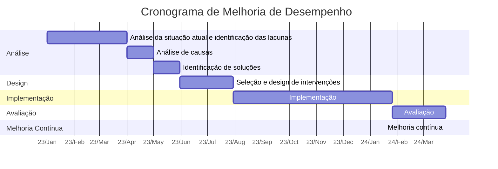

Um guia abrangente que explora os princípios, metodologias e aplicações da Tecnologia de Desempenho Humano (HPT) para melhorar o desempenho nas organizações.

> [!info]  
> - O artigo explora a Tecnologia de Desempenho Humano (HPT), uma abordagem integrada para melhorar o desempenho humano nas organizações. A HPT é baseada na premissa de que as organizações são sistemas e que o desempenho dentro desses sistemas é influenciado por múltiplos fatores. A HPT pode ajudar as organizações a identificar lacunas de desempenho e desenvolver intervenções direcionadas para alcançar seus objetivos de forma mais eficaz. 
> - O artigo conclui destacando a importância de uma abordagem sistemática e baseada em evidências para a melhoria do desempenho, e a necessidade de uma análise profunda para identificar as causas raiz dos problemas e implementar soluções eficazes.
> - Ou apenas assista ao vídeo...

## I. O que é Tecnologia de Desempenho Humano (HPT)? 

A Tecnologia de Desempenho Humano, também conhecida como Melhoria de Desempenho, é uma abordagem integrada de sistemas para melhorar o desempenho humano. É um campo de estudo e prática que se baseia em várias disciplinas, incluindo psicologia, [design instrucional](https://d4t.dev/notes/Design-instrucional/mapeamento-de-licoes-baseado-em-desempenho), desenvolvimento organizacional e recursos humanos, entre outros.

A HPT é baseada na premissa de que as organizações são sistemas e que o desempenho dentro desses sistemas é influenciado por múltiplos fatores. Esses fatores podem incluir as habilidades e conhecimentos dos indivíduos, as ferramentas e recursos disponíveis, a estrutura e cultura da organização e os sistemas e processos em vigor.

> Deming fez um diagnóstico excelente: 94% da qualidade depende do sistema. Os outros 6% são causas especiais. É como na carpintaria: o resultado final depende muito mais da sua bancada e ferramentas do que de uma martelada ocasional fora do lugar.

## II. O Papel da HPT nas Organizações 

Nas organizações, a HPT desempenha um papel crucial na melhoria da eficiência, produtividade e desempenho geral. Ao identificar lacunas de desempenho e desenvolver intervenções direcionadas, a HPT pode ajudar as organizações a alcançar seus objetivos e metas de forma mais eficaz.

Por exemplo, se uma organização está lutando com baixa produtividade, um profissional de HPT pode realizar uma análise de desempenho para identificar as causas raiz. Isso pode revelar que os funcionários não têm as habilidades ou conhecimentos necessários para realizar suas tarefas de forma eficiente, ou que os processos em vigor são ineficientes. Com base nesta análise, o profissional de HPT pode então desenvolver intervenções direcionadas, como programas de treinamento ou melhorias de processos, para abordar essas questões. 

### HPT e Desempenho Humano e Organizacional (HOP) 

Um dos conceitos-chave na HPT é a ideia de Desempenho Humano e Organizacional (HOP). Esta abordagem, defendida por figuras como o Dr. Todd Conklin, enfatiza a importância de olhar para a interação entre o trabalhador e o sistema, em vez de se concentrar apenas no comportamento individual do trabalhador ou no sistema em si.

A abordagem HOP reconhece que o desempenho é influenciado por uma variedade de fatores, tanto individuais quanto sistêmicos. Ela busca entender como esses fatores interagem e como eles podem ser otimizados para melhorar o desempenho. Esta abordagem pode ser particularmente eficaz em ambientes complexos e de alto risco, onde as consequências de lacunas de desempenho podem ser graves.

### HPT e Design Thinking

Outro conceito que está intimamente relacionado à HPT é o Design Thinking. Esta é uma abordagem de resolução de problemas que nos encoraja a ir além de nossa própria compreensão da situação e buscar perspectivas diversas para encontrar o conjunto de soluções que melhor se adapta aos nossos usuários-alvo. É um processo iterativo e não linear que coloca as pessoas em primeiro lugar, assumindo que quando priorizamos as pessoas, os resultados de desempenho desejados seguirão.

O Design Thinking pode ser uma ferramenta valiosa no conjunto de ferramentas do profissional de HPT. Ele pode ajudar a garantir que as soluções sejam centradas no usuário e que levem em conta a complexidade total do ambiente de desempenho. Ao se concentrar na experiência do usuário, o Design Thinking pode ajudar a garantir que as soluções sejam não apenas eficazes, mas também envolventes e satisfatórias para as pessoas que as utilizam.

A Tecnologia de Desempenho Humano é uma abordagem poderosa para melhorar o desempenho nas organizações. Ao adotar uma abordagem sistemática e baseada em evidências, a HPT pode ajudar as organizações a identificar lacunas de desempenho, desenvolver intervenções direcionadas e alcançar seus objetivos de forma mais eficaz. Seja através da aplicação de princípios HOP, do uso de metodologias de Design Thinking ou de outras ferramentas e técnicas, a HPT oferece um quadro abrangente para entender e melhorar o desempenho humano.

Na próxima seção, vamos aprofundar as metodologias e ferramentas usadas na HPT, e como elas podem ser aplicadas em diferentes contextos organizacionais.

O HPT é altamente sistemático e baseia-se em análise e design. Ele se concentra em identificar as causas fundamentais dos problemas de desempenho, ao invés de simplesmente tratar os sintomas. Isso geralmente envolve uma análise detalhada do ambiente de trabalho, dos processos de negócios e do comportamento humano.

Quando uma lacuna de desempenho é identificada, devemos trabalhar para desenvolver intervenções eficazes para fechar essa lacuna. Isso pode envolver uma ampla gama de soluções, desde o treinamento e desenvolvimento de habilidades até a modificação dos processos de negócios ou a alteração do ambiente de trabalho. 

O uso de padrões e práticas rigorosas no campo do desempenho humano e da engenharia instrucional, de forma consistente e cientificamente fundamentada é essencial para melhorar efetivamente o desempenho. e para uma análise profundada para identificar as causas raiz dos problemas e implementar soluções eficazes. 

Embora a abordagem específica possa variar dependendo das circunstâncias, um resumo geral do processo seria algo assim:

1. **Análise da situação atual e identificação das lacunas de desempenho**: A primeira etapa é entender o desempenho atual e identificar onde existem lacunas. Isso pode envolver a análise de dados de desempenho, a observação direta dos trabalhadores no ambiente de trabalho e a realização de entrevistas ou pesquisas para obter mais informações sobre os problemas existentes.
2. **Análise de causas**: Depois que as lacunas de desempenho são identificadas, a próxima etapa é entender por que elas estão ocorrendo. Isso pode envolver a análise de fatores como as habilidades e conhecimentos dos trabalhadores, as práticas de gestão, a organização do trabalho e o ambiente de trabalho.
3. **Identificação de soluções**: Com base na análise de causas, identifica-se possíveis soluções para os problemas de desempenho. Isso pode envolver uma variedade de intervenções, desde o treinamento e o desenvolvimento de habilidades até a reestruturação dos processos de trabalho.
4. **Seleção e design de intervenções**: Com base na identificação de possíveis soluções, seleciona-se as intervenções mais promissoras e projeta-se um plano de implementação. Essas intervenções podem variar amplamente, dependendo das necessidades específicas da organização e do problema de desempenho em questão. Elas podem incluir treinamento e desenvolvimento, mudanças no ambiente de trabalho, reestruturação dos processos de trabalho, revisão de políticas e práticas de gestão, entre outros.
5. **Implementação**: A próxima etapa é implementar as intervenções escolhidas. Isso pode envolver uma variedade de atividades, desde a condução de programas de treinamento até a reorganização dos processos de trabalho ou a alteração do ambiente de trabalho.
6. **Avaliação**: Uma vez implementadas as intervenções, lembre-se da importância de avaliar o impacto dessas mudanças no desempenho. Isso geralmente envolve a coleta e análise de dados de desempenho para determinar se as lacunas de desempenho foram efetivamente fechadas.
7. **Melhoria contínua**: Finalmente, a melhoria do desempenho é um processo contínuo. Com base na avaliação, as intervenções podem ser ajustadas e melhoradas ao longo do tempo para garantir que continuem a ser eficazes.

Esta é uma visão geral da abordagem de HPT, e cada etapa pode envolver muitos detalhes adicionais, dependendo das circunstâncias específicas. É também importante notar a importância de uma abordagem baseada em evidências, o que significa que todas as decisões devem ser informadas por dados confiáveis e análises rigorosas.

| Passo | Nome                          | Descrição                                                                                                                           |
|-------|-------------------------------|-------------------------------------------------------------------------------------------------------------------------------------|
| 1     | Análise de Lacunas            | Identificar lacunas de desempenho comparando a situação atual com os objetivos desejados.                                         |
| 2     | Análise de Causas             | Investigar as causas subjacentes das lacunas de desempenho identificadas.                                                         |
| 3     | Identificação de Soluções     | Identificar possíveis soluções para abordar as causas das lacunas de desempenho.                                                  |
| 4     | Seleção e Design de Intervenções| Selecionar as soluções mais eficazes e projetar intervenções para implementá-las.                                                  |
| 5     | Implementação                | Colocar as intervenções selecionadas em prática, monitorar o progresso e fazer ajustes conforme necessário.                         |
| 6     | Avaliação                    | Medir e analisar o impacto e a eficácia das intervenções implementadas para determinar se estão gerando os resultados desejados.  |
| 7     | Melhoria Contínua            | Estabelecer um compromisso contínuo com a avaliação, aprendizado e aprimoramento dos processos de negócios.                        |

## III. Metodologias e Ferramentas em HPT

A HPT utiliza uma variedade de ferramentas e metodologias para analisar o desempenho e desenvolver soluções. Estas podem incluir análise de desempenho, análise de causa raiz, seleção e design de intervenção, e avaliação de resultados. As ferramentas e metodologias específicas utilizadas podem variar dependendo da situação e das necessidades específicas da organização.

### Análise de Desempenho

A análise de desempenho é um primeiro passo crítico no processo de HPT. Envolve a identificação do nível atual de desempenho, o nível desejado de desempenho e a lacuna entre os dois. Esta lacuna é muitas vezes referida como a lacuna de desempenho.

A análise de desempenho pode envolver uma variedade de técnicas, incluindo observação, entrevistas, pesquisas e análise de dados. O objetivo é obter uma compreensão abrangente da situação atual de desempenho e dos fatores que a influenciam.

### Análise de Causa Raiz

Uma vez identificada a lacuna de desempenho, o próximo passo é determinar por que ela existe. É aqui que entra a análise de causa raiz. A análise de causa raiz é um método de resolução de problemas que visa identificar as causas subjacentes dos problemas ou eventos.

Existem muitas técnicas diferentes de análise de causa raiz, mas todas envolvem um processo de perguntar por que o problema ocorreu e depois continuar a perguntar por que até que a causa raiz seja identificada.

### Seleção e Design de Intervenção 

Após as causas raiz da lacuna de desempenho terem sido identificadas, o próximo passo é selecionar e projetar intervenções para abordar essas causas. Estas intervenções podem incluir programas de treinamento, mudanças nos processos ou sistemas, mudanças na estrutura ou cultura organizacional, ou qualquer outra mudança que possa ajudar a melhorar o desempenho.

A seleção e o design das intervenções devem ser baseados em uma compreensão completa da lacuna de desempenho e suas causas, bem como do contexto específico e das necessidades da organização.

### Avaliação de Resultados

O passo final no processo de HPT é avaliar os resultados das intervenções. Isto envolve medir o impacto das intervenções no desempenho e determinar se a lacuna de desempenho foi fechada.

A avaliação pode envolver uma variedade de métodos, incluindo medidas de desempenho pré e pós-intervenção, pesquisas, entrevistas e análise de dados. O objetivo é determinar se as intervenções foram eficazes e identificar quaisquer áreas para futuras melhorias.

## 1. Análise da situação atual e identificação das lacunas de desempenho

O primeiro passo na abordagem HPT é a análise da situação atual e a identificação de lacunas de desempenho. Nessa etapa, ele está essencialmente tentando entender o "estado atual" - como as coisas estão funcionando agora - e identificar onde existem lacunas ou problemas de desempenho.

Para fazer isso, geralmente emprega uma variedade de técnicas de coleta de dados e análise. Aqui estão alguns exemplos de como isso pode ser feito:

- **Análise de Dados de Desempenho**: Uma das primeiras coisas a fazer é analisar quaisquer dados de desempenho existentes. Isso pode incluir coisas como relatórios de produtividade, indicadores-chave de desempenho (KPIs), resultados de pesquisas de satisfação do cliente, relatórios de erros ou defeitos, entre outros. Analisar esses dados pode ajudar a identificar áreas onde o desempenho está aquém do esperado ou onde houve uma queda no desempenho.
- **Observação Direta**: Em alguns casos, pode-se observações diretas dos trabalhadores no ambiente de trabalho. Isso pode fornecer insights valiosos sobre como o trabalho está sendo feito, onde podem existir ineficiências ou problemas, e como esses problemas podem estar afetando o desempenho.
- **Entrevistas e Pesquisas**: Também pode-se conduzir entrevistas ou pesquisas com os trabalhadores e outros stakeholders para obter mais informações sobre os problemas de desempenho. Isso pode ajudar a identificar problemas que não são imediatamente aparentes a partir dos dados de desempenho ou da observação direta.
- **Análise de Processo de Negócio**: Outra ferramenta é a análise de processo de negócio. Isso envolve mapear os processos de trabalho atuais para entender como as coisas estão sendo feitas e onde podem existir ineficiências ou oportunidades para melhoria.

No geral, o objetivo dessa etapa é obter uma compreensão clara e abrangente da situação atual e identificar onde existem lacunas de desempenho. Uma vez que essas lacunas tenham sido identificadas, então é possível começar a trabalhar para entender as causas dessas lacunas e identificar possíveis soluções.

| Etapa                   | Descrição                                                                                                                                                                                                                                                                                                                                                                                                                                                                                         | Ferramentas e Técnicas        |
|-------------------------|-------------------------------------------------------------------------------------------------------------------------------------------------------------------------------------------------------------------------------------------------------------------------------------------------------------------------------------------------------------------------------------------------------------------------------------------------------------------------------------------------|-------------------------------|
| Coleta de Dados         | Coletar todos os dados relevantes de desempenho disponíveis, incluindo relatórios de produtividade, KPIs, resultados de pesquisas de satisfação do cliente e relatórios de erros ou defeitos.                                                                                                                                                                                                                                                                                                 | - Planilhas de dados - Relatórios de desempenho - Pesquisas de satisfação do cliente |
| Observação Direta       | Observar os trabalhadores no ambiente de trabalho para obter insights sobre como o trabalho está sendo feito, onde podem existir ineficiências ou problemas e como esses problemas podem estar afetando o desempenho.                                                                                                                                                                                                                                                                           | - Observação direta - Checklists de observação |
| Entrevistas e Pesquisas | Conduzir entrevistas ou pesquisas com trabalhadores e outros stakeholders para obter mais informações sobre os problemas de desempenho. Isso pode ajudar a identificar problemas que não são imediatamente aparentes a partir dos dados de desempenho ou da observação direta.                                                                                                                                                                                                                     | - Roteiros de entrevista - Questionários de pesquisa |
| Análise de Processos de Negócio    | Mapear os processos de trabalho atuais para entender como as coisas estão sendo feitas e onde podem existir ineficiências ou oportunidades para melhoria.                                                                                                                                                                                                                                                                                                                                           | - Diagramas de fluxo de trabalho - Modelos de processo de negócio |
| Identificação de Lacunas de Desempenho | Analisar os dados coletados e identificar áreas onde o desempenho está aquém do esperado ou onde houve uma queda no desempenho. Isso pode envolver comparar os resultados atuais com as metas de desempenho, analisar tendências ao longo do tempo ou comparar o desempenho com outras unidades ou organizações semelhantes.                                                                                                                                                                | - Análise de dados - Comparação de benchmarks |
| Documentação e Relatório             | Documentar os resultados da análise, incluindo uma descrição clara das lacunas de desempenho identificadas, as possíveis causas dessas lacunas e quaisquer recomendações para melhorias. Preparar um relatório que detalhe os resultados da análise e as lacunas de desempenho identificadas, para que possam ser usados como base para as próximas etapas do processo de Engenharia de Desempenho Humano.                                                                                        | - Relatórios escritos - Apresentações visuais |

Este job aid pode ser adaptado conforme necessário para atender às necessidades específicas de sua organização ou projeto. Ele pode ser usado como um guia para ajudar a garantir que a análise da situação atual e a identificação das lacunas de desempenho sejam realizadas de forma abrangente e sistemática.

### Análise de Processo de Negócio 

A análise de processos de negócio é uma técnica usada para entender e avaliar a eficiência e eficácia dos processos existentes dentro de uma organização. É uma parte fundamental da gestão de processos de negócio e pode ser utilizada para identificar áreas de melhoria e redesenhar processos para aumentar a eficiência operacional.

Aqui está um passo a passo detalhado de como geralmente funciona:

1. **Identificação de Processos**: O primeiro passo na análise de processos de negócio é identificar os processos que serão analisados. Normalmente, esses são processos que são críticos para o sucesso do negócio ou aqueles onde se suspeita que existam problemas ou ineficiências.
2. **Coleta de Informações**: Uma vez que os processos tenham sido identificados, a próxima etapa é coletar informações sobre como esses processos funcionam atualmente. Isso pode envolver a coleta de documentos e procedimentos existentes, observação direta do processo em ação e entrevistas com pessoas que estão envolvidas no processo. 
3. **Mapeamento de Processos**: As informações coletadas são então usadas para criar um mapa ou diagrama do processo. Esse mapa pode mostrar todas as etapas do processo, quem está envolvido em cada etapa, quais são os inputs e outputs de cada etapa e como as diferentes etapas estão interligadas. Existem várias ferramentas e técnicas que podem ser usadas para criar esses mapas, incluindo diagramas de fluxo de trabalho, diagramas de fluxo de dados e notação de modelagem de processos de negócios (BPMN).
4. **Análise do Processo**: Com o mapa do processo em mãos, o próximo passo é analisar o processo para identificar áreas de melhoria. Isso pode envolver a busca por ineficiências, gargalos, redundâncias, ou etapas que não agregam valor. Também pode envolver a análise de métricas de desempenho do processo, como tempo de ciclo, custo, qualidade, entre outros.
5. **Redesenho do Processo**: Com base na análise, o processo pode então ser redesenhado para melhorar a eficiência e eficácia. Isso pode envolver a eliminação de etapas desnecessárias, a automatização de partes do processo, a reorganização do fluxo de trabalho, a implementação de novas tecnologias, entre outros.
6. **Implementação e Monitoramento**: Finalmente, o processo redesenhado é implementado e monitorado para garantir que está funcionando conforme o esperado e para avaliar se as mudanças resultaram em melhorias no desempenho.

A análise de processos de negócio é uma ferramenta poderosa para melhorar a eficiência operacional e a eficácia dos processos de negócios. No Análiseentanto, é importante notar que ela deve ser realizada de forma sistemática e com um entendimento claro dos objetivos do negócio para ser eficaz.

Claro! Aqui está uma tabela job-aid detalhada para a análise de processos de negócio:

| Etapa             | Descrição                                                                                                                                                                                                                                               | Ações e Ferramentas                                                                                                                                                                                                            |
|-------------------|---------------------------------------------------------------------------------------------------------------------------------------------------------------------------------------------------------------------------------------------------------|--------------------------------------------------------------------------------------------------------------------------------------------------------------------------------------------------------------------------------|
| 1. Identificação de Processos | Selecione os processos que serão analisados, com foco nos processos críticos ou aqueles com suspeita de problemas ou ineficiências.                                                           | - Priorize processos com base em impacto no negócio, problemas conhecidos ou oportunidades de melhoria.                                                                                                                       |
| 2. Coleta de Informações      | Colete informações sobre o funcionamento atual dos processos selecionados por meio de documentos, observação direta e entrevistas.                                                             | - Reúna documentos e procedimentos existentes. - Observe o processo em ação. - Entreviste pessoas envolvidas no processo.                                                                                               |
| 3. Mapeamento de Processos    | Crie um mapa ou diagrama do processo, mostrando todas as etapas, participantes, inputs e outputs, e como as etapas estão interligadas.                                                         | - Utilize diagramas de fluxo de trabalho, diagramas de fluxo de dados ou notação de modelagem de processos de negócios (BPMN).                                                                                                |
| 4. Análise do Processo        | Analise o mapa do processo para identificar áreas de melhoria, ineficiências, gargalos, redundâncias ou etapas que não agregam valor.                                                          | - Identifique ineficiências e gargalos. - Avalie a necessidade de cada etapa no processo. - Analise métricas de desempenho, como tempo de ciclo, custo e qualidade.                                                    |
| 5. Redesenho do Processo      | Com base na análise, redesenhe o processo para melhorar a eficiência e eficácia, eliminando etapas desnecessárias ou automatizando partes do processo, entre outras melhorias.                  | - Elimine etapas desnecessárias ou redundantes. - Automatize partes do processo. - Reorganize o fluxo de trabalho. - Implemente novas tecnologias ou abordagens.                                                      |
| 6. Implementação e Monitoramento | Implemente o processo redesenhado e monitore seu desempenho para garantir que está funcionando conforme o esperado e para avaliar se as mudanças resultaram em melhorias no desempenho. | - Implemente o novo processo e comunique as mudanças à equipe. - Monitore o desempenho do processo redesenhado por meio de métricas e indicadores-chave de desempenho (KPIs). - Ajuste o processo conforme necessário. |

Esta tabela job-aid pode ser usada como um guia prático para realizar análises de processos de negócio e ajudar a garantir que cada etapa seja concluída de maneira eficiente e eficaz. Sinta-se à vontade para adaptá-la às necessidades específicas da sua organização ou projeto.

## 2. Análise de causas

A análise de causas, também conhecida como análise de causa raiz, é um processo usado para identificar as causas fundamentais dos problemas de desempenho, em vez de apenas tratar os sintomas. O objetivo é entender por que as lacunas de desempenho estão ocorrendo para que possam ser abordadas de maneira eficaz.

Aqui está um passo a passo detalhado de como a análise de causas pode ser conduzida.

1. **Revisão das Lacunas de Desempenho Identificadas**: O primeiro passo na análise de causas é revisar as lacunas de desempenho que foram identificadas durante a análise inicial. Isso envolve uma revisão detalhada dos dados de desempenho, observações e outras informações coletadas para garantir que se tenha uma compreensão clara e precisa dos problemas que estão sendo enfrentados.
2. **Identificação de Possíveis Causas**: Com base na revisão das lacunas de desempenho, a próxima etapa é identificar as possíveis causas dessas lacunas. Isso pode envolver uma variedade de técnicas, desde a brainstorming até a análise de dados. Lembre-se da importância de considerar uma ampla gama de possíveis causas, incluindo fatores relacionados à tarefa, ao indivíduo, à equipe, à organização e ao ambiente.
3. **Análise de Causas**: Uma vez identificadas as possíveis causas, a próxima etapa é analisar cada uma para determinar quais são as causas mais prováveis. Isso pode envolver uma avaliação mais aprofundada dos dados, realização de experimentos ou testes, ou coleta de informações adicionais. Ferramentas como o diagrama de Ishikawa (também conhecido como diagrama de causa e efeito ou diagrama de espinha de peixe) ou a técnica de "5 porquês" podem ser úteis aqui. Essas técnicas ajudam a organizar o pensamento e promovem uma abordagem sistemática para identificar a causa raiz dos problemas.
4. **Verificação das Causas**: Após a análise das possíveis causas, as causas prováveis são então verificadas. Isso pode envolver a revisão adicional de dados, a realização de testes ou experimentos adicionais, ou a coleta de mais informações para confirmar que essas são realmente as causas dos problemas de desempenho. O objetivo é garantir que as intervenções de melhoria de desempenho sejam direcionadas às causas corretas.
5. **Documentação das Causas**: Finalmente, as causas identificadas e verificadas são documentadas. Isso geralmente envolve a criação de um relatório ou outro documento que detalha as lacunas de desempenho, as causas identificadas, a evidência que suporta essas conclusões e quaisquer outras informações relevantes. Essa documentação pode então ser usada para informar o design e a implementação de intervenções de melhoria de desempenho.

É importante lembrar que a análise de causas é um processo iterativo. Pode ser necessário voltar e revisar as informações coletadas, identificar novas possíveis causas, realizar análises adicionais ou coletar mais informações à medida que novas informações são descobertas ou se as causas iniciais não são confirmadas. A chave é estar disposto a seguir a evidência aonde quer que ela leve e estar aberto à possibilidade de que as causas iniciais possam não ser as corretas.

| Etapa                             | Descrição                                                                                                                                                       | Ferramentas e Técnicas                                                                                          |
|-----------------------------------|-----------------------------------------------------------------------------------------------------------------------------------------------------------------|-----------------------------------------------------------------------------------------------------------------|
| 1. Revisão das possíveis causas   | Revise a lista de possíveis causas identificadas durante a fase de identificação de causas. Certifique-se de que todas as causas possíveis sejam consideradas. | - Lista de possíveis causas                                                                                     |
| 2. Organizar possíveis causas     | Agrupe causas semelhantes ou relacionadas para facilitar a análise.                                                                                            | - Diagrama de Ishikawa (diagrama de espinha de peixe)                                                           |
| 3. Priorizar causas               | Determine quais causas são mais prováveis ou têm maior impacto no desempenho, com base na evidência disponível.                                                | - Matriz de priorização (por exemplo, impacto x probabilidade)                                                   |
| 4. Coletar dados adicionais       | Se necessário, colete mais informações ou dados para ajudar na análise das causas.                                                                             | - Entrevistas, pesquisas, análise de documentos                                                                 |
| 5. Testar hipóteses               | Teste as hipóteses sobre as causas do problema de desempenho. Use experimentos, análises de dados ou outros métodos para verificar se a causa é verdadeira.   | - Experimentos, análise estatística, simulações                                                                 |
| 6. Eliminar causas improváveis    | Remova as causas que foram demonstradas como improváveis ou irrelevantes para o problema de desempenho com base na análise.                                   | - Registros de análise, dados coletados                                                                         |
| 7. Identificar causas prováveis   | Identifique as causas que são mais prováveis com base na análise realizada.                                                                                    | - Relatório de análise de causas                                                                                |
| 8. Verificar as causas            | Confirme se as causas prováveis são realmente as causas raiz dos problemas de desempenho. Reúna evidências adicionais, se necessário.                         | - Entrevistas, pesquisas, testes adicionais                                                                     |
| 9. Documentar os resultados       | Registre os resultados da análise de causas, incluindo as causas prováveis identificadas, a evidência que suporta essas conclusões e quaisquer outras informações relevantes. | - Relatório de análise de causas, documentos de suporte |

Este job-aid pode ser usado como um guia durante a condução da análise de causas, ajudando a garantir que todas as etapas sejam seguidas e que a análise seja completa e baseada em evidências.

## 3. Identificação de soluções

A identificação de soluções é o próximo passo para a melhoria do desempenho. Depois de entender a situação atual, identificar as lacunas de desempenho e analisar as causas dessas lacunas, o foco muda para a identificação de possíveis soluções para esses problemas. Aqui está um passo a passo detalhado de como esse processo pode ser conduzido:

1. **Brainstorming de Possíveis Soluções**: Com base na compreensão das causas das lacunas de desempenho, o primeiro passo na identificação de soluções é o brainstorming de possíveis soluções. Isso pode envolver uma equipe de pessoas que tenham uma variedade de perspectivas sobre o problema, incluindo aquelas que estão diretamente envolvidas no processo ou tarefa em questão. A chave aqui é encorajar uma ampla gama de ideias e evitar julgar ou avaliar as ideias nesta fase inicial.
2. **Análise das Soluções**: Depois de ter uma lista de possíveis soluções, a próxima etapa é analisá-las. Isso envolve a avaliação de cada solução em termos de sua viabilidade, custo, impacto potencial, e qualquer outra consideração relevante. Isso pode ser feito através de uma variedade de métodos, incluindo análise de custo-benefício, análise SWOT (Forças, Fraquezas, Oportunidades e Ameaças), análise de risco, entre outros. O objetivo é identificar as soluções que são mais propensas a serem eficazes e que se alinham com os recursos disponíveis, as metas e os objetivos estratégicos da organização.
3. **Seleção de Soluções**: Com base na análise, as soluções mais promissoras são selecionadas para implementação. É importante notar que pode haver várias soluções viáveis para um determinado problema, e a escolha entre elas pode depender de uma variedade de fatores, incluindo o custo, o tempo, os recursos disponíveis, a cultura da organização, entre outros.
4. **Desenvolvimento de um Plano de Implementação**: Uma vez que as soluções foram selecionadas, o próximo passo é desenvolver um plano para implementá-las. Isso geralmente inclui a definição de responsabilidades, prazos, recursos necessários, e outros detalhes logísticos. Além disso, o plano de implementação deve incluir uma estratégia para monitorar a eficácia da solução e fazer ajustes conforme necessário.
5. **Comunicação do Plano**: Finalmente, o plano de implementação é comunicado àqueles que serão afetados por ele ou que terão um papel em sua implementação. Isso pode incluir a equipe de gestão, os funcionários, os acionistas, os clientes, ou outros stakeholders. A comunicação eficaz do plano pode ajudar a garantir o buy-in e o suporte para a solução, o que pode aumentar a probabilidade de sucesso.

Ao longo de todo este processo, é importante manter uma mentalidade aberta e flexível. As soluções que parecem promissoras no início podem não funcionar na prática, ou novas informações podem surgir que mudam a compreensão do problema. Portanto, a identificação de soluções deve ser um processo contínuo e adaptável.

| Etapa                 | Descrição                                                                                                                                                                                                                                                     |
|-----------------------|---------------------------------------------------------------------------------------------------------------------------------------------------------------------------------------------------------------------------------------------------------------|
| 1. Brainstorming      | Reúna uma equipe com diferentes perspectivas e experiências relacionadas ao problema em questão. Incentive a geração de ideias sem julgamento ou avaliação. Documente todas as ideias sugeridas.                                                             |
| 2. Análise de Soluções | Avalie cada solução proposta em termos de viabilidade, custo, impacto potencial e outras considerações relevantes. Utilize ferramentas como análise de custo-benefício, análise SWOT, análise de risco, etc., para ajudar nessa avaliação.                    |
| 3. Seleção de Soluções | Com base na análise, escolha as soluções mais promissoras que se alinhem com os recursos disponíveis, metas e objetivos estratégicos da organização. Considere fatores como custo, tempo, cultura organizacional, entre outros, ao tomar a decisão.          |
| 4. Plano de Implementação | Desenvolva um plano detalhado para implementar as soluções selecionadas. Defina responsabilidades, prazos, recursos necessários e outros detalhes logísticos. Inclua uma estratégia para monitorar a eficácia da solução e fazer ajustes conforme necessário. |
| 5. Comunicação do Plano | Comunique o plano de implementação aos stakeholders relevantes, como a equipe de gestão, funcionários, acionistas, clientes, etc. Garanta que todos entendam o plano e estejam comprometidos com o sucesso da solução proposta.                                |

Esta tabela Job Aid resume o processo de identificar soluções para problemas de desempenho, fornecendo uma visão geral das etapas e ações a serem tomadas em cada etapa. Você pode usá-la como um guia para orientar seu processo de identificação e implementação de soluções em sua organização.

## 4. Seleção e design de intervenções

A seleção e o design de intervenções é o quarto passo no processo de melhoria de desempenho. Uma vez que as soluções possíveis foram identificadas e analisadas, o próximo passo é selecionar as intervenções mais apropriadas e eficazes e projetá-las para a implementação. Aqui está um passo a passo detalhado de como esse processo pode ser conduzido:

1. **Avaliação das Intervenções Potenciais**: A primeira etapa no processo de seleção e design de intervenções é avaliar as possíveis intervenções que foram identificadas durante a fase de identificação de soluções. Isso pode envolver uma análise mais aprofundada de cada intervenção potencial, incluindo a consideração de fatores como custo, tempo, recursos necessários, probabilidade de sucesso e alinhamento com os objetivos estratégicos da organização.
2. **Seleção de Intervenções**: Com base nesta avaliação, as intervenções mais promissoras são selecionadas para o design e implementação. A decisão de quais intervenções selecionar pode depender de uma variedade de fatores e pode requerer um equilíbrio entre o ideal e o que é praticamente realizável.
3. **Design de Intervenções**: Uma vez que as intervenções foram selecionadas, o próximo passo é projetá-las para a implementação. Isso pode envolver a elaboração de planos detalhados para cada intervenção, incluindo a definição de metas e objetivos, a identificação de etapas e processos específicos, a alocação de recursos e a determinação de responsabilidades.
4. **Desenvolvimento de Materiais e Recursos de Suporte**: Dependendo da natureza da intervenção, pode ser necessário desenvolver materiais e recursos de suporte. Isso pode incluir manuais de treinamento, guias de procedimentos, software ou outras ferramentas tecnológicas, ou outros recursos que ajudem a implementar a intervenção de forma eficaz.
5. **Teste e Revisão de Intervenções**: Antes da implementação completa, as intervenções podem ser testadas em uma escala menor ou em um ambiente controlado. Isso permite que sejam feitos ajustes e refinamentos antes da implementação em larga escala. O feedback dos usuários finais e outras partes interessadas pode ser particularmente útil nesta fase.
6. **Finalização do Design da Intervenção**: Com base no teste e revisão, o design da intervenção é finalizado e preparado para a implementação. Isso pode envolver a realização de ajustes finais, a finalização de materiais e recursos de suporte, e a comunicação do plano final para todas as partes interessadas relevantes.

Ao longo deste processo, é importante lembrar que o design de intervenções deve ser um processo iterativo e adaptativo. É possível que as intervenções precisem ser ajustadas ou modificadas à medida que novas informações se tornam disponíveis, ou à medida que a situação muda. A chave é estar disposto a aprender e adaptar-se para maximizar a eficácia das intervenções.
| Etapa                                                 | Descrição                                                    | Dicas/Considerações                                          |
| ----------------------------------------------------- | ------------------------------------------------------------ | ------------------------------------------------------------ |
| 1. Avaliação das Intervenções Potenciais              | Analise as intervenções potenciais identificadas na fase de Identificação de Soluções. Considere fatores como custo, tempo, recursos necessários, probabilidade de sucesso e alinhamento com os objetivos estratégicos da organização. | - Pondere os prós e contras de cada intervenção. - Leve em conta as limitações e recursos disponíveis. |
| 2. Seleção de Intervenções                            | Com base na avaliação, selecione as intervenções mais promissoras para design e implementação. Considere fatores como custo-benefício, viabilidade e impacto potencial. | - Pondere o equilíbrio entre o ideal e o praticamente realizável. - Obtenha aprovação e feedback das partes interessadas. |
| 3. Design de Intervenções                             | Elabore planos detalhados para cada intervenção selecionada. Defina metas e objetivos, identifique etapas e processos específicos, aloque recursos e determine responsabilidades. | - Seja claro e específico em relação às expectativas e resultados desejados. - Certifique-se de que o design da intervenção seja adaptável e ajustável conforme necessário. |
| 4. Desenvolvimento de Materiais e Recursos de Suporte | Desenvolva materiais e recursos de suporte, conforme necessário, para cada intervenção. Isso pode incluir manuais de treinamento, guias de procedimentos, ferramentas tecnológicas ou outros recursos que auxiliem na implementação eficaz da intervenção. | - Adapte os materiais e recursos às necessidades específicas do público-alvo. - Teste e revise os materiais e recursos para garantir que sejam eficazes e de fácil utilização. |
| 5. Teste e Revisão de Intervenções                    | Teste as intervenções em uma escala menor ou em um ambiente controlado antes da implementação completa. Use o feedback dos usuários finais e outras partes interessadas para fazer ajustes e refinamentos no design da intervenção. | - Seja aberto ao feedback e esteja disposto a fazer ajustes com base nos resultados do teste. - Identifique possíveis problemas ou obstáculos e planeje soluções antes da implementação em larga escala. |
| 6. Finalização do Design da Intervenção               | Com base no teste e revisão, finalize o design da intervenção e prepare-o para a implementação. Isso pode envolver a realização de ajustes finais, a finalização de materiais e recursos de suporte e a comunicação do plano final para todas as partes interessadas relevantes. | - Comunique claramente as expectativas e responsabilidades a todas as partes envolvidas na implementação da intervenção. |

### A diferença entre identificar soluções e o design de soluções

Os passos 3 e 4 parecem semelhantes, pois ambos envolvem a identificação e a seleção de soluções ou intervenções para resolver problemas de desempenho. No entanto, eles se concentram em diferentes aspectos do processo de melhoria do desempenho e têm objetivos ligeiramente diferentes.

1. **Identificação de soluções (Passo 3)**: Este passo é focado em *brainstorming* e análise de uma ampla gama de possíveis soluções para as lacunas de desempenho identificadas. A ideia aqui é ser criativo e aberto a uma variedade de possíveis abordagens para resolver o problema. O objetivo é criar uma lista de possíveis soluções que possam ser analisadas e avaliadas para determinar sua viabilidade e potencial eficácia.
2. **Seleção e Design de Intervenções (Passo 4)**: Este passo é focado em selecionar as soluções mais promissoras da lista criada durante o passo 3 e depois projetá-las para a implementação. Isso envolve uma análise mais detalhada e específica de cada solução potencial, incluindo a consideração de fatores como custo, tempo, recursos necessários, probabilidade de sucesso e alinhamento com os objetivos estratégicos da organização. O objetivo aqui é selecionar as soluções que serão implementadas e, em seguida, projetar um plano detalhado para a implementação dessas soluções.

Em outras palavras, o passo 3 é mais sobre a geração de ideias e opções possíveis, enquanto o passo 4 é sobre a escolha das melhores dessas opções e o planejamento de como colocá-las em prática.

### Exemplos de soluções

O HPT não fornece uma lista específica de "soluções mais comuns", porque as soluções apropriadas para qualquer problema de desempenho dependem muito das circunstâncias específicas desse problema. 

No entanto, o HPT defende uma abordagem sistemática para a identificação e análise de soluções potenciais, a fim de encontrar as mais eficazes e eficientes para um determinado contexto. Isso pode envolver uma ampla gama de possíveis intervenções, dependendo do problema em questão.

Por exemplo, se o problema de desempenho é causado por falta de habilidades ou conhecimento, as soluções podem incluir treinamento, coaching, desenvolvimento de materiais de aprendizagem, ou outras intervenções educacionais. Se o problema é causado por problemas de motivação ou engajamento, as soluções podem incluir mudanças nos incentivos, na cultura organizacional, ou em outros aspectos do ambiente de trabalho. Se o problema é causado por falhas de processo, as soluções podem envolver a reengenharia de processos, a implementação de novas ferramentas ou tecnologias, ou outras mudanças nos procedimentos de trabalho.

A chave é identificar a causa raiz do problema de desempenho e, em seguida, selecionar a solução que é mais provável de resolver efetivamente esse problema, dadas as circunstâncias específicas da situação.

Aqui estão alguns exemplos de áreas e setores, juntamente com possíveis problemas e soluções. 

1. **Área: Treinamento e Desenvolvimento**
   - Setor: Tecnologia
   - Problema: Funcionários não estão atualizados com as últimas habilidades e conhecimentos.
   - Solução: Implementar programas de treinamento e desenvolvimento contínuos, workshops e sessões de mentoring.
2. **Área: Gestão de Projetos**
   - Setor: Construção
   - Problema: Projetos atrasados e acima do orçamento.
   - Solução: Aprimorar a metodologia de gerenciamento de projetos, melhorar a comunicação entre as partes interessadas e estabelecer processos de monitoramento e controle de custos.
3. **Área: Manufatura e Produção**
   - Setor: Automobilístico
   - Problema: Baixa eficiência na linha de produção e alto índice de defeitos.
   - Solução: Reengenharia de processos, implementação de sistemas de controle de qualidade e treinamento da equipe de produção.
4. **Área: Atendimento ao Cliente**
   - Setor: Varejo
   - Problema: Baixa satisfação do cliente e alto tempo de espera.
   - Solução: Treinar a equipe de atendimento ao cliente em habilidades de comunicação, implementar sistemas de gerenciamento de filas e desenvolver políticas e procedimentos para lidar com reclamações.
5. **Área: Gestão de Talentos**
   - Setor: Saúde
   - Problema: Alta rotatividade e baixo engajamento dos funcionários.
   - Solução: Implementar programas de retenção e engajamento, como reconhecimento e recompensas, oportunidades de desenvolvimento de carreira e melhor equilíbrio entre vida pessoal e profissional.

Aqui está uma tabela resumida dos exemplos acima:

| Área                   | Setor        | Problema                                      | Solução                                      |
|------------------------|--------------|-----------------------------------------------|----------------------------------------------|
| Treinamento e Desenvolvimento | Tecnologia   | Funcionários desatualizados                  | Treinamento contínuo, workshops, mentoring   |
| Gestão de Projetos     | Construção   | Projetos atrasados e acima do orçamento       | Melhorar a metodologia, comunicação e controle|
| Manufatura e Produção  | Automobilístico | Baixa eficiência, alto índice de defeitos    | Reengenharia de processos, controle de qualidade, treinamento |
| Atendimento ao Cliente | Varejo       | Baixa satisfação do cliente, alto tempo de espera | Treinamento, gerenciamento de filas, políticas de reclamações |
| Gestão de Talentos     | Saúde        | Alta rotatividade, baixo engajamento          | Programas de retenção e engajamento, equilíbrio vida-trabalho |

## 5. Implementação

O passo 5, Implementação, envolve colocar as intervenções selecionadas e projetadas em prática. Este é um passo crítico, pois é quando a organização realmente começa a ver os resultados das melhorias de desempenho. A implementação pode variar dependendo das intervenções específicas escolhidas e do contexto da organização. Aqui está uma descrição detalhada do processo de implementação:

1. **Comunicação**: Comunique claramente as intervenções, objetivos e expectativas a todos os envolvidos, incluindo a alta gerência, funcionários e outras partes interessadas. Isso ajuda a garantir que todos estejam alinhados e comprometidos com a mudança.
2. **Alocação de Recursos**: Garanta que os recursos necessários, como financiamento, pessoal e equipamentos, estejam disponíveis e alocados para as intervenções. Isso pode incluir a contratação ou realocação de pessoal, a aquisição de novas ferramentas ou tecnologias e a alocação de tempo e orçamento.
3. **Treinamento**: Se necessário, forneça treinamento e suporte aos funcionários para garantir que eles compreendam e possam executar com sucesso as novas intervenções. Isso pode envolver sessões de treinamento em grupo, workshops, coaching individual ou outros métodos de desenvolvimento profissional.
4. **Monitoramento**: Estabeleça sistemas de monitoramento e acompanhamento para medir o progresso e o sucesso das intervenções. Isso pode incluir indicadores de desempenho-chave (KPIs), metas e marcos específicos, relatórios de progresso e feedback dos funcionários.
5. **Ajustes**: Com base no monitoramento e feedback, faça ajustes conforme necessário para garantir que as intervenções estejam funcionando conforme o esperado e gerando resultados positivos. Isso pode envolver a realização de mudanças nos processos, políticas, recursos ou outros aspectos das intervenções.
6. **Avaliação**: Avalie o sucesso das intervenções em termos de melhorias de desempenho e alcance dos objetivos. Use essa informação para informar futuras decisões sobre intervenções adicionais ou ajustes nas intervenções existentes.

| Etapa         | Ação                                                | Ferramentas e Recursos                                | Dicas e Melhores Práticas                                                   |
|---------------|-----------------------------------------------------|-------------------------------------------------------|-----------------------------------------------------------------------------|
| Comunicação   | Comunique as intervenções, objetivos e expectativas | Apresentações, e-mails, reuniões, intranet corporativa| - Personalize a comunicação para diferentes públicos-alvo                  |
|               |                                                     |                                                       | - Use exemplos e histórias para ilustrar o impacto das intervenções        |
| Alocação de   | Identifique e aloque recursos necessários           | Orçamento, pessoal, equipamentos, instalações        | - Envolva a alta gerência na alocação de recursos                          |
| Recursos      |                                                     |                                                       | - Priorize recursos com base na urgência e importância das intervenções    |
| Treinamento   | Forneça treinamento e suporte aos funcionários      | Cursos, workshops, coaching, materiais de treinamento | - Adapte o treinamento às necessidades e preferências dos funcionários     |
|               |                                                     |                                                       | - Monitore o progresso do treinamento e ajuste conforme necessário         |
| Monitoramento | Estabeleça sistemas de monitoramento e acompanhamento| Indicadores de desempenho-chave (KPIs), metas, relatórios| - Defina metas claras e realistas para as intervenções                    |
|               |                                                     |                                                       | - Estabeleça pontos de verificação regulares para monitorar o progresso   |
| Ajustes       | Faça ajustes com base no monitoramento e feedback   | Relatórios de progresso, feedback dos funcionários    | - Esteja aberto a feedback e disposto a ajustar as intervenções            |
|               |                                                     |                                                       | - Comunique quaisquer mudanças às partes interessadas                      |
| Avaliação     | Avalie o sucesso das intervenções                   | Pesquisas, análise de dados, relatórios de desempenho | - Use uma abordagem baseada em dados para avaliar o sucesso                |
|               |                                                     |                                                       | - Considere o impacto de longo prazo das intervenções                      |

Esta tabela Job-Aid pode ser usada como um guia para ajudar a implementar as intervenções selecionadas e projetadas, garantindo que todos os aspectos importantes sejam abordados e que o processo de implementação seja bem-sucedido.

## 6. Avaliação

O passo 6, Avaliação, é uma parte essencial do processo de melhoria do desempenho. Ele se concentra em medir e analisar o impacto e a eficácia das intervenções implementadas. Isso permite que a organização determine se as soluções selecionadas estão gerando os resultados desejados e identifique áreas para ajustes ou melhorias adicionais. Aqui está uma descrição detalhada do processo de avaliação:

1. **Definição de critérios e indicadores**: Estabeleça critérios claros e objetivos para avaliar o sucesso das intervenções. Identifique indicadores-chave de desempenho (KPIs) e outras métricas relevantes que ajudarão a medir o progresso em relação aos objetivos estabelecidos.
2. **Coleta de dados**: Reúna dados relacionados aos indicadores e métricas identificados. Isso pode envolver o uso de pesquisas, entrevistas, observações, análise de registros ou outras fontes de informação. Certifique-se de coletar dados suficientes para fornecer uma avaliação abrangente e precisa do impacto das intervenções.
3. **Análise de dados**: Analise os dados coletados para determinar o grau em que as intervenções implementadas estão alcançando os objetivos estabelecidos. Isso pode envolver a comparação de dados pré e pós-intervenção, análise de tendências, comparação com benchmarks ou outras técnicas de análise.
4. **Interpretação dos resultados**: Com base na análise de dados, interprete os resultados para entender o impacto e a eficácia das intervenções. Identifique áreas de sucesso, bem como áreas que podem exigir ajustes ou melhorias adicionais.
5. **Comunicação dos resultados**: Comunique os resultados da avaliação aos tomadores de decisão, funcionários e outras partes interessadas. Isso ajuda a garantir que todos estejam cientes do progresso e do impacto das intervenções, e pode ajudar a informar futuras decisões e ações relacionadas à melhoria do desempenho.
6. **Ajustes e melhorias contínuas**: Use os resultados da avaliação para informar a tomada de decisões sobre ajustes nas intervenções existentes ou a implementação de novas soluções para abordar lacunas de desempenho ou áreas de melhoria. Isso permite uma abordagem contínua de melhoria do desempenho, garantindo que a organização continue a progredir em direção a seus objetivos.

A avaliação é um processo contínuo e iterativo que ajuda a garantir que as intervenções de melhoria do desempenho sejam eficazes e que a organização esteja sempre avançando na direção certa. Ao conduzir avaliações regulares e ajustando as intervenções conforme necessário, a organização pode continuar a adaptar-se às mudanças nas condições e às necessidades em evolução.

| Etapa                         | Descrição                                                                                                                                                        |
|-------------------------------|------------------------------------------------------------------------------------------------------------------------------------------------------------------|
| Definição de critérios e indicadores | Estabeleça critérios claros e objetivos para avaliar o sucesso das intervenções; identifique KPIs e outras métricas relevantes                                   |
| Coleta de dados               | Reúna dados relacionados aos indicadores e métricas identificados usando pesquisas, entrevistas, observações, análise de registros ou outras fontes de informação |
| Análise de dados              | Analise os dados coletados para determinar o grau em que as intervenções implementadas estão alcançando os objetivos estabelecidos                                |
| Interpretação dos resultados  | Interprete os resultados para entender o impacto e a eficácia das intervenções; identifique áreas de sucesso e áreas que exigem ajustes ou melhorias adicionais |
| Comunicação dos resultados    | Comunique os resultados da avaliação aos tomadores de decisão, funcionários e outras partes interessadas para informar futuras decisões e ações                    |
| Ajustes e melhorias contínuas | Use os resultados da avaliação para informar a tomada de decisões sobre ajustes nas intervenções existentes ou implementação de novas soluções                      |

Esta tabela job-aid detalhada pode servir como um guia prático para a realização do passo 6, Avaliação, no processo de melhoria de desempenho. A tabela fornece uma visão geral das etapas envolvidas e o propósito de cada etapa.

### Entendendo as diferenças entre a Avaliação, e a avaliação inserida dentro do passo 5, implementação.

Embora a avaliação seja um componente tanto do passo 5 (Implementação) quanto do passo 6 (Avaliação), há algumas diferenças-chave entre os dois. Aqui estão as principais diferenças entre a avaliação realizada durante a implementação e a avaliação como um passo separado no processo:

**Avaliação durante a Implementação (Passo 5)**:

1. **Foco no progresso e ajustes**: A avaliação durante a implementação se concentra em monitorar o progresso das intervenções à medida que são colocadas em prática. Isso permite que a organização faça ajustes e melhorias em tempo real, garantindo que as intervenções sejam eficazes e relevantes.
2. **Métodos de monitoramento e acompanhamento**: Durante a implementação, a avaliação envolve o uso de sistemas de monitoramento e acompanhamento para medir o progresso e o sucesso das intervenções. Isso pode incluir a análise de indicadores de desempenho-chave (KPIs), metas e marcos específicos, relatórios de progresso e feedback dos funcionários.
3. **Adaptação e flexibilidade**: A avaliação durante a implementação ajuda a garantir que as intervenções sejam adaptáveis e flexíveis, permitindo que a organização responda rapidamente a mudanças nas condições ou necessidades.

**Avaliação como Passo Separado (Passo 6)**:

1. **Foco na eficácia e impacto**: A avaliação como um passo separado no processo se concentra na medição da eficácia e do impacto das intervenções após a implementação. Isso permite que a organização determine se as soluções selecionadas estão gerando os resultados desejados e identifique áreas para ajustes ou melhorias adicionais.
2. **Métodos de coleta e análise de dados**: No passo 6, a avaliação envolve a coleta de dados relacionados aos indicadores e métricas identificados, seguida pela análise desses dados para determinar o grau em que as intervenções implementadas estão alcançando os objetivos estabelecidos.
3. **Avaliação abrangente**: A avaliação como um passo separado no processo fornece uma visão mais abrangente do impacto e da eficácia das intervenções, permitindo que a organização tome decisões informadas sobre futuras ações e melhorias.

Para concluir, a avaliação durante a implementação se concentra no monitoramento do progresso e na realização de ajustes em tempo real, enquanto a avaliação como um passo separado no processo se concentra na medição do impacto e eficácia das intervenções após a implementação. Ambos os aspectos da avaliação são importantes para garantir que a organização alcance seus objetivos de melhoria de desempenho.

| Aspecto             | Avaliação durante Implementação (Passo 5)                                           | Avaliação como Passo Separado (Passo 6)                                   |
|---------------------|-------------------------------------------------------------------------------------|---------------------------------------------------------------------------|
| Foco                | Progresso e ajustes das intervenções                                                | Eficácia e impacto das intervenções após implementação                    |
| Métodos             | Monitoramento e acompanhamento (KPIs, metas, marcos, relatórios, feedback)          | Coleta e análise de dados (pesquisas, entrevistas, observações, registros)|
| Objetivos           | Adaptação e flexibilidade; ajustes em tempo real                                    | Avaliação abrangente; decisões informadas sobre futuras ações e melhorias |
| Tempo de aplicação  | Durante a fase de implementação das intervenções                                    | Após a implementação das intervenções                                     |

Essa tabela job-aid pode ser usada como um guia rápido para entender as diferenças entre a avaliação durante a implementação e a avaliação como um passo separado no processo de melhoria de desempenho.

## 7. Melhoria contínua

O passo 7, Melhoria Contínua, é uma parte fundamental do processo de melhoria de desempenho, pois enfatiza a importância de um compromisso contínuo com a avaliação e o aprimoramento dos processos de negócios. A melhoria contínua ajuda a garantir que a organização se adapte e evolua de acordo com as mudanças nas condições de mercado, necessidades dos clientes e outras variáveis. Aqui está uma descrição detalhada do processo de melhoria contínua:

1. **Ciclo de feedback**: Estabeleça um ciclo de feedback regular para garantir que a informação sobre o desempenho e o progresso das intervenções seja coletada e analisada continuamente. Isso pode incluir a realização de revisões periódicas, pesquisas de satisfação do cliente, reuniões de equipe ou outros mecanismos de feedback.
2. **Análise de tendências e padrões**: Identifique tendências e padrões no desempenho da organização e nas intervenções implementadas. Use essa informação para identificar áreas de sucesso, bem como áreas que podem exigir ajustes ou melhorias adicionais.
3. **Aprendizado organizacional**: Promova uma cultura de aprendizado e desenvolvimento dentro da organização. Incentive os funcionários a compartilhar conhecimentos, ideias e melhores práticas, e forneça oportunidades para desenvolvimento profissional contínuo.
4. **Ajustes e otimização**: Com base nos resultados da avaliação e no feedback contínuo, faça ajustes nas intervenções existentes ou implemente novas soluções conforme necessário. Isso pode incluir a revisão de processos, políticas, estruturas organizacionais ou outros aspectos das intervenções para garantir a eficácia e a eficiência contínuas.
5. **Inovação**: Fomente um ambiente de inovação e criatividade, encorajando a experimentação e a busca de novas ideias e abordagens. Isso pode ajudar a organização a identificar e explorar novas oportunidades de melhoria de desempenho.
6. **Monitoramento e avaliação contínua**: Continue a monitorar e avaliar o desempenho da organização e das intervenções implementadas ao longo do tempo. Isso permite que a organização ajuste e refine suas estratégias de melhoria de desempenho conforme necessário.

A melhoria contínua é um processo abrangente e de longo prazo que envolve um compromisso constante com a avaliação, aprendizado e aprimoramento. Ao integrar a melhoria contínua em sua cultura e práticas organizacionais, a organização pode garantir que esteja sempre avançando em direção aos seus objetivos e se adaptando às necessidades em constante mudança do ambiente de negócios.

| Componente                 | Descrição                                                                                                                                                 |
|----------------------------|-----------------------------------------------------------------------------------------------------------------------------------------------------------|
| Ciclo de feedback          | Estabeleça um ciclo de feedback regular para coletar e analisar informações sobre o desempenho e progresso das intervenções.                              |
| Análise de tendências      | Identifique tendências e padrões no desempenho da organização e nas intervenções implementadas para ajustar e melhorar conforme necessário.               |
| Aprendizado organizacional | Promova uma cultura de aprendizado e desenvolvimento, incentivando a troca de conhecimento, ideias e melhores práticas entre os funcionários.              |
| Ajustes e otimização       | Faça ajustes nas intervenções existentes ou implemente novas soluções com base nos resultados da avaliação e no feedback contínuo.                        |
| Inovação                   | Fomente um ambiente de inovação e criatividade, encorajando a experimentação e a busca de novas ideias e abordagens para melhoria de desempenho.          |
| Monitoramento contínuo     | Monitore e avalie o desempenho da organização e das intervenções implementadas ao longo do tempo para ajustar e refinar as estratégias conforme necessário.|

Esta tabela job-aid pode ser usada como um guia rápido para compreender e aplicar o conceito de melhoria contínua no contexto do processo de melhoria de desempenho.

## IV. Cronograma

Embora seja difícil fornecer um cronograma específico para o processo inteiro de melhoria de desempenho, é possível fornecer algumas orientações gerais sobre a duração de cada etapa. Vale lembrar que a duração de cada etapa dependerá de fatores específicos da organização e do projeto em questão, como a complexidade do problema, a disponibilidade de recursos e a necessidade de mudanças.

1. **Análise da situação atual e identificação das lacunas (Passo 1)**: Dependendo da complexidade do problema e do tamanho da organização, essa etapa pode levar de algumas semanas a alguns meses.
2. **Análise de causas (Passo 2)**: A análise de causas pode levar de algumas semanas a um mês ou mais, dependendo da complexidade do problema e do nível de detalhe exigido.
3. **Identificação de soluções (Passo 3)**: A identificação e avaliação de soluções em potencial pode levar de algumas semanas a um mês, dependendo do número de alternativas e da quantidade de informações necessárias para avaliá-las.
4. **Seleção e design de intervenções (Passo 4)**: Dependendo da complexidade das intervenções e da necessidade de desenvolvimento de recursos e materiais, essa etapa pode levar de algumas semanas a alguns meses.
5. **Implementação (Passo 5)**: A duração da fase de implementação varia amplamente, dependendo da complexidade e da escala das intervenções. Pode variar de alguns meses a um ano ou mais.
6. **Avaliação (Passo 6)**: A avaliação pode ser realizada ao longo da implementação e após a conclusão das intervenções. Dependendo dos métodos de coleta e análise de dados, essa etapa pode levar de algumas semanas a alguns meses.
7. **Melhoria contínua (Passo 7)**: A melhoria contínua é um processo contínuo e de longo prazo, e não possui uma duração específica.

No geral, o processo de melhoria de desempenho pode levar de vários meses a mais de um ano, dependendo de fatores específicos do projeto e da organização. Vale ressaltar que, em alguns casos, várias etapas do processo podem ser realizadas simultaneamente ou em paralelo para economizar tempo e recursos.

## V. Melhoria de desempenho, HPT e o T&D

A melhoria contínua no ambiente organizacional é fundamental para o crescimento e desenvolvimento dos colaboradores, garantindo a competitividade e o sucesso da empresa. O treinamento e a capacitação dos profissionais são elementos-chave nesse processo, proporcionando aos funcionários as competências necessárias para enfrentar os desafios do mercado. Através de um plano de desenvolvimento estratégico, as organizações podem investir em programas de treinamento que abordam habilidades específicas, alinhados aos objetivos de carreira e metas de desempenho dos colaboradores.

A gestão de pessoas, ou Recursos Humanos (RH), desempenha um papel crucial na criação de uma cultura organizacional que valoriza o aprendizado e o desenvolvimento de habilidades. Com a implementação de métodos de treinamento eficazes, os colaboradores podem aprimorar suas competências e contribuir para o sucesso da estratégia de negócios. Além disso, a aprendizagem contínua e o desenvolvimento profissional são fundamentais para atrair e reter talentos, garantindo a sustentabilidade da empresa.

Para alcançar uma melhoria contínua no desempenho dos colaboradores, é essencial seguir um processo estruturado que inclui análise de lacunas, identificação de soluções, implementação e avaliação. O HPT é uma abordagem eficaz para enfrentar os desafios do desenvolvimento organizacional. Integrando a metodologia com as práticas de RH e a cultura organizacional, as empresas podem garantir que seus colaboradores estejam preparados para enfrentar os desafios do mercado e contribuir para o sucesso da organização.

## VI. Linha do tempo

I apologize for the inconvenience. It seems there is a technical issue with the translation service. I'll try again.

**Resumo Profissional:**

O artigo intitulado "History of HPT – Per Rummler" é uma conta detalhada da evolução da Tecnologia de Desempenho Humano (HPT) conforme narrado por Geary A. Rummler, Ph.D. O artigo é fortemente baseado em um artigo de 2003 de Rummler, que foi um contribuidor significativo para o campo da HPT. Ele destaca as duas fases distintas na história da HPT: a descoberta dos princípios básicos da HPT pelos pensadores/inovadores originais e a "descoberta" do poder e aplicação dos princípios pelo resto do mundo.

Rummler fornece uma história pessoal de seu envolvimento no campo, começando na década de 1960, e suas interações com outras figuras-chave como Dale Brethower, Susan Markle, Don Tosti, Roger Kaufman, e muitos mais. Ele discute o desenvolvimento de várias oficinas, teorias e modelos que contribuíram para o crescimento da HPT. Ele também aborda alguns equívocos sobre a evolução da HPT e o papel do Design de Sistemas Instrucionais (ISD) em seu desenvolvimento.

**Linha do Tempo:**

- **Década de 1960:** Rummler e outros estabelecem a base do que se tornaria a HPT.
- **1960:** Don Tosti se alista na Revolução Educacional.
- **1961:** Rummler e Dale Brethower se juntam ao staff do Institute for Behavioral Research and Programmed Instruction, Inc.
- **1962:** Rummler e o Professor George Odiorne fundam o University of Michigan’s Center for Programmed Learning for Business.
- **1963:** Rummler e Brethower reconhecem que o aprendizado nem sempre resulta em desempenho melhorado.
- **1964:** Rummler desenvolve o modelo Human Performance System.
- **1965:** Rummler e Brethower adicionam o Training Systems Workshop ao currículo do Centro.
- **1968:** Rummler se torna presidente nacional do NSPI.
- **1969:** Rummler se muda para a Costa Leste para formar a Praxis Corporation com Tom Gilbert e Irving Goldberg.
- **1970:** Mager publica a primeira edição de "Analyzing Performance Problems".
- **1972:** Gilbert começa a trabalhar no que eventualmente se torna "Human Competence".
- **1979:** Praxis é vendida e Gilbert e Rummler seguem direções separadas.
- **1982:** Rummler forma The Rummler Group.
- **1987:** Rummler forma o Rummler-Brache Group com Alan Brache.
- **1990:** "Improving Performance" (Rummler e Brache) é publicado.

## VII. Saiba mais

- [Guy W. Wallace](https://tppannex.wordpress.com/about-me/)
- [Human Performance Technology (HPT) Treasures](https://hpttreasures.wordpress.com/)
- [EPPIC - Pursuing Performance](https://www.youtube.com/@pursuingperformance) no Youtube
- [Guy Wallace on Performance Needs Analysis Learning Expert Talks](https://www.youtube.com/watch?v=N1mzLOWXHe8)
- [Alex Salas](https://stylelearn.com/)

