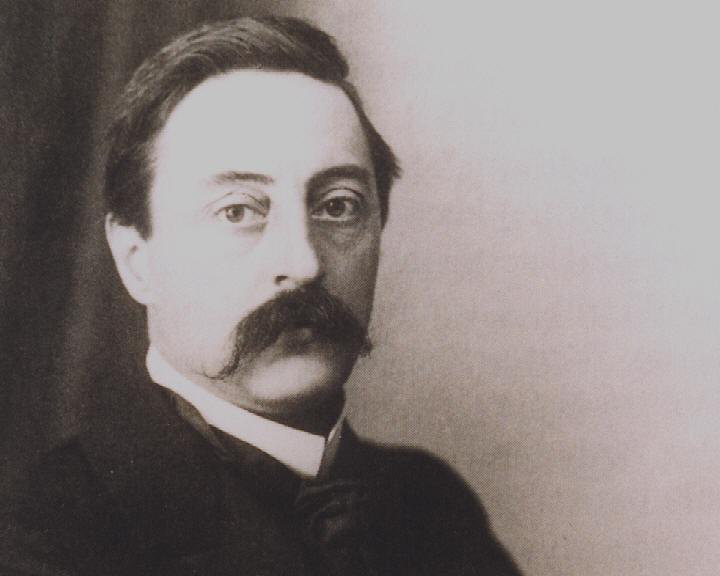

*Arnold van Gennep*

Arnold van Gennep é um antropólogo francês conhecido por seu trabalho sobre a teoria dos ritos de passagem. Sua obra influenciou profundamente a antropologia e seus estudos são considerados fundamentais para entender a natureza humana e a forma como lidamos com os eventos que marcam nossa vida. Neste artigo, discutiremos a obra de Arnold van Gennep e a teoria dos ritos de passagem.

## Arnold van Gennep e a Teoria dos Ritos de Passagem

Arnold van Gennep foi um antropólogo francês que viveu no final do século XIX e início do século XX. Sua obra mais conhecida é o livro "Os Ritos de Passagem", publicado em 1909, no qual ele apresenta sua teoria sobre os ritos que marcam a transição de uma fase da vida para outra.

Segundo van Gennep, os ritos de passagem são eventos que marcam a transição de um estado para outro. Eles são encontrados em todas as culturas e sociedades e são divididos em três fases: a separação, a liminaridade e a incorporação. Na fase de separação, o indivíduo é retirado de seu estado anterior e colocado em um estado de transição. Na fase de liminaridade, o indivíduo se encontra em um estado de limbo, em que ele não pertence mais ao estado anterior, mas ainda não faz parte do novo estado. Finalmente, na fase de incorporação, o indivíduo é reintegrado à sociedade em seu novo estado.

A teoria de van Gennep foi uma das primeiras a explorar a importância dos ritos de passagem na vida humana. Ele argumentou que esses ritos são uma forma de lidar com a mudança e a transição, ajudando os indivíduos a enfrentar os desafios que surgem ao longo da vida.

## Ritos de Passagem na Sociedade

Os ritos de passagem são uma parte importante da vida em sociedade. Eles são encontrados em todas as culturas e sociedades, desde os rituais de iniciação nas tribos africanas até as festas de formatura nas sociedades ocidentais.

Esses rituais têm várias funções na sociedade. Eles ajudam a definir a identidade do indivíduo, marcando a transição de uma fase da vida para outra. Eles também ajudam a estabelecer a hierarquia social, mostrando quem tem o direito de assumir determinados papéis na sociedade.

Além disso, os ritos de passagem são uma forma de controlar o comportamento humano. Eles estabelecem as regras e normas sociais, determinando o que é aceitável e o que não é em determinado momento da vida.

Exemplos de Ritos de Passagem

Existem muitos exemplos de ritos de passagem nas diversas culturas do mundo. Aqui estão alguns exemplos:

-   Circuncisão: Na cultura judaica, a circuncisão é um rito de passagem realizado em meninos de oito dias de vida. Ele marca a entrada na aliança entre Deus e o povo de Israel.
-   Puberdade: Em muitas culturas africanas, a puberdade é um rito de passagem importante. As meninas passam por um período de isolamento em que aprendem sobre seus papéis sociais e como se tornar mulheres. Depois desse período, elas são apresentadas à sociedade como mulheres adultas.
-   Festa de 15 anos: Na cultura latina, a festa de 15 anos é um rito de passagem para meninas que marcam a entrada na vida adulta. A festa é uma celebração extravagante em que a menina é apresentada à sociedade.
-   Formatura: Nas sociedades ocidentais, a formatura é um rito de passagem que marca a conclusão dos estudos e a entrada na vida adulta. É um momento em que os formandos celebram seu sucesso e são reconhecidos pela sociedade.

>[!example]- A questão do Trote
> 
>Na nossa sociedade moderna, o rito de passagem mais comum é o batismo estudantil, também conhecido como "bizutagem" na França, "Hazing" nos Estados Unidos ou "trote" no Brasil. Essa cerimônia ocorre no início do ano letivo e permite que os novos estudantes sejam iniciados na comunidade estudantil. O ritual inclui os três estágios: separação, margem e agregação.
>
>Durante a separação, o estudante perde sua identidade social e corporal, sendo obrigado a usar alguma roupa, ser chamado por um apelido, entre outras exigências. Ao mesmo tempo, ocorre uma espécie de guerra entre os novos e os antigos alunos, com desafios e punições fictícias para parodiar a instituição de ensino. Já na agregação, ocorre uma cerimônia de "purificação", seguida de uma celebração com muita comida e bebida.
>
>No entanto, é importante destacar que muitas vezes esses ritos de passagem podem levar a comportamentos degradantes e até mesmo violentos. Nos trotes, por exemplo, já tivemos vários casos de abusos e humilhações que levaram à exclusão de estudantes e até mesmo a processos judiciais e tragédias.

## A Importância dos Ritos de Passagem

Os ritos de passagem são importantes porque ajudam os indivíduos a lidar com as mudanças e transições ao longo da vida. Eles fornecem uma estrutura para entender e lidar com a transição de uma fase da vida para outra.

Além disso, os ritos de passagem são uma forma de conectar as pessoas e as comunidades. Eles fornecem um senso de identidade e pertencimento, mostrando que as pessoas fazem parte de algo maior do que elas mesmas.

Por fim, os ritos de passagem são uma forma de preservar as tradições e a história das comunidades. Eles mantêm vivas as histórias e os costumes dos antepassados, garantindo que essas tradições sejam passadas adiante para as gerações futuras.

De acordo com a teoria de Arnold van Gennep, os ritos de passagem são compostos por três fases: a separação, a liminaridade e a incorporação.

## Primeiro Estágio: Separação

O primeiro estágio dos ritos de passagem é a separação. Nessa fase, o indivíduo é retirado do estado anterior e colocado em um estado de transição. Esse processo pode ser voluntário ou involuntário, dependendo do tipo de rito de passagem.

Durante a fase de separação, o indivíduo é afastado de sua vida cotidiana e das pessoas com as quais ele convive. Ele pode ser colocado em um local isolado, como uma floresta, uma caverna ou uma cabana. Essa separação do mundo anterior é importante para que o indivíduo possa se concentrar no processo de transição e nas mudanças que ele irá enfrentar.

## Segundo Estágio: Liminaridade

O segundo estágio dos ritos de passagem é a liminaridade. Nessa fase, o indivíduo se encontra em um estado de limbo, em que ele não pertence mais ao estado anterior, mas ainda não faz parte do novo estado.

Durante a liminaridade, o indivíduo passa por um processo de transformação, em que ele é despojado de suas antigas identidades e aprende novas habilidades e conhecimentos que serão necessários no novo estado. Essa fase é geralmente acompanhada por rituais e cerimônias que ajudam o indivíduo a compreender e internalizar essas mudanças.

A liminaridade é um período de incerteza e instabilidade, em que o indivíduo se sente desorientado e vulnerável. No entanto, é também um período de grande potencial, em que o indivíduo pode aprender muito sobre si mesmo e sobre o mundo ao seu redor.

## Terceiro Estágio: Incorporação

O terceiro estágio dos ritos de passagem é a incorporação. Nessa fase, o indivíduo é reintegrado à sociedade em seu novo estado.

Durante a fase de incorporação, o indivíduo é apresentado à sociedade como alguém que agora ocupa um novo papel ou posição. Ele pode ser recebido com festas, cerimônias e outras formas de celebração que marcam sua entrada na nova fase da vida.

A incorporação é um momento de estabilização e consolidação, em que o indivíduo se ajusta ao novo estado e se adapta às novas responsabilidades e obrigações que ele agora tem.

## Conclusão

Os ritos de passagem são eventos que marcam a transição de um estado para outro e são compostos por três fases: a separação, a liminaridade e a incorporação. Cada uma dessas fases desempenha um papel importante no processo de transição e ajuda os indivíduos a lidar com as mudanças e transições ao longo da vida. A teoria de Arnold van Gennep é fundamental para entender a natureza humana e a forma como lidamos com os eventos que marcam nossa vida.