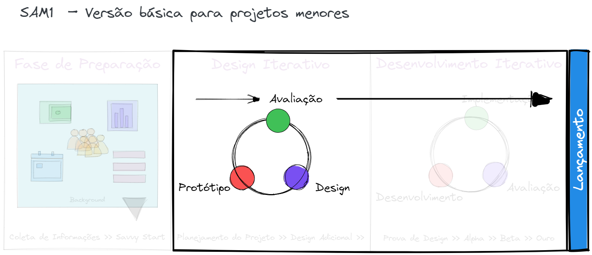
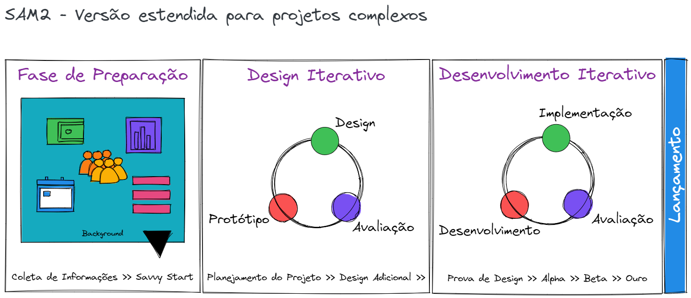

O Modelo de Aproximação Sucessiva (SAM) é uma versão simplificada do Modelo ADDIE, especialmente projetado para fornecer feedback e construir modelos de trabalho desde o início do processo de **design instrucional**. 

Criado pelo Dr. Michael Allen, este modelo utiliza umprocesso recursivo[^1] em vez do linear para o desenvolvimento da experiência de aprendizagem. 
[^1]: Que se pode repetir um número indefinido de vezes

Este modelo é composto de três partes: Preparação, Projeto Iterativo e Desenvolvimento Iterativo. A palavra-chave aqui é iterativo, ou seja, cada etapa deve ser repetida e revisada quantas vezes forem necessárias. Os resultados de cada etapa definem a próxima, que também pode ser repetida e revisada.

O modelo SAM mais simples é composto de três partes: 
- Preparação, 
- Projeto Iterativo,
- Desenvolvimento Iterativo. 

A palavra-chave aqui é iterativo - feito de novo, repetido, reiterado - a base desse modelo. Cada etapa deve ser repetida e revisitada quantas vezes forem necessárias. Os seus resultados definem a próxima etapa que, ela mesma, pode ser repetida e revisitada.

## **SAM1** – Versão básica para projetos menores

O modelo SAM mais simples é composto de três partes: 
- Preparação, 
- Projeto Iterativo,
- Desenvolvimento Iterativo. 

O processo básico, conhecido como SAM1, é uma boa opção para projetos ou equipes menores. Este modelo simples consiste em três iterações das etapas tradicionais de **design instrucional**: Análise, Design e Desenvolvimento. Com esta abordagem, as ideias e suposições de todos podem ser discutidas, prototipadas e testadas já no início, aproximando-o rapidamente de um produto utilizável.

E se seu projeto for mais complexo? É aí que o SAM2 entra em jogo.

## **SAM2** – Versão estendida para projetos complexos

Para projetos mais complexos, entra em cena o SAM2, versão estendida do SAM1. Este modelo consiste em oito etapas de design iterativo, distribuídas em três fases do projeto: Preparação, Design Iterativo e Desenvolvimento Iterativo.

### Fase de Preparação 
A Fase de Preparação é uma das etapas importantes no modelo SAM, pois é nesta fase que se estabelecem as bases para o sucesso do projeto. Nesta fase, as equipes devem identificar e entender os objetivos do projeto, definir as equipes envolvidas, estabelecer as expectativas dos stakeholders e definir as metodologias e ferramentas que serão utilizadas ao longo do projeto.

O "Savvy Start" é uma abordagem que tem como objetivo maximizar o potencial de sucesso do projeto desde o início. É nesta fase que se estabelecem as bases para o sucesso futuro, incluindo a definição dos objetivos e expectativas do projeto, a definição da equipe envolvida, a definição das metodologias e ferramentas e a definição dos indicadores de sucesso. Além disso, o Savvy Start também enfatiza a importância de estabelecer as bases para a comunicação eficaz entre todas as partes envolvidas. 

A Fase de Preparação no modelo SAM é crucial para garantir o sucesso do projeto e o Savvy Start é uma abordagem que ajuda a maximizar este potencial de sucesso, estabelecendo as bases corretas desde o início.

### Fase de Design Iterativo

Nesta fase, o processo de design e desenvolvimento é aperfeiçoado através da revisão e da melhoria contínuas. Nesta etapa, a equipe irá:

1.  Criar um protótipo inicial
2.  Testar o protótipo com usuários reais
3.  Revisar o feedback dos usuários e ajustar o projeto
4.  Refinar o protótipo e testá-lo novamente
5.  Continuar a revisar e ajustar o projeto até atingir o objetivo desejado

A revisão e a melhoria são repetidas até que se alcance a satisfação dos usuários e a eficiência do projeto. A equipe também irá avaliar se é necessário repetir as etapas anteriores do processo SAM2.

### Fase de Desenvolvimento Iterativo

Na fase final, o projeto é desenvolvido e implementado com base nas etapas anteriores de design e revisão. A equipe irá:

1.  Desenvolver e produzir o material final
2.  Testar o material final com usuários reais
3.  Revisar o feedback dos usuários e fazer ajustes finais
4.  Implementar o material final para uso

A implementação e a revisão final são repetidas até que se atinja a satisfação dos usuários e a eficiência do projeto.

## Benefícios do Modelo de Aproximação Sucessiva (SAM)

O modelo SAM oferece muitos benefícios em comparação a outros modelos de desenvolvimento de **design instrucional**. Alguns dos principais benefícios incluem:

1.  Feedback constante e revisão contínua
2.  Projetos mais eficientes e eficazes
3.  Aceleração do tempo de produção
4.  Aumento da satisfação dos usuários
5.  Flexibilidade para ajustes e melhorias ao longo do processo

Além disso, o modelo SAM permite que as equipes trabalhem de maneira colaborativa e eficiente, garantindo que todos os envolvidos estejam alinhados aos objetivos e metas do projeto.

## Conclusão: o que é melhor, ADDIE ou SAM?

O Modelo de Aproximação Sucessiva (SAM) é uma abordagem inovadora e eficiente para o desenvolvimento de **design instrucional**. Oferece muitos benefícios em comparação a outros modelos, incluindo feedback constante, projetos mais eficientes e aceleração do tempo de produção.

Qual modelo de design é mais adequado para você e sua equipe? [Fases do ADDIE](Fases%20do%20ADDIE.md) ou SAM?

Quando aplicada nas situações onde existe comprometimento de todos os envolvidos, a flexibilidade do SAM pode levá-lo a finalizar uma experiência de aprendizagem bem mais rápido. A abordagem iterativa ajuda você a usar protótipos para obter o *feedback* das partes interessadas rapidamente e facilita a mudança de seus requisitos de curso. 

No entanto, muitos designers instrucionais trabalham em organizações que adotaram a agilidade **na teoria, mas não tanto na prática**. Aplicar uma abordagem ágil como o SAM pode ser difícil quando seu ambiente não incentiva *feedback rápido* ou *processos flexíveis*. Nesses casos, o modelo tradicional do ADDIE pode ser uma escolha melhor.

Como o ADDIE é um método usado há décadas, os clientes, stakeholders (e até mesmo os membros da equipe) podem ficar mais confortáveis com sua previsibilidade e organização. Ainda que não seja tão flexível quanto o SAM, muitas pessoas aplicam uma versão adaptada do ADDIE que inclui alguns *loops iterativos* para aproveitar os pontos fortes de ambos os métodos.

