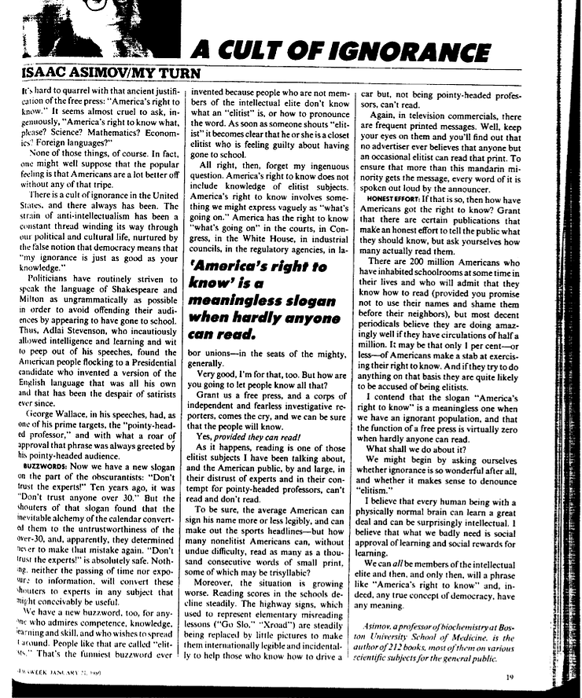

É difícil discutir com a antiquíssima justificativa para a liberdade de imprensa: "*O Direito de Saber da América*". Parece quase cruel perguntar, ingênuo, "*Por favor, o direito da América saber o quê*"? Ciência? Matemática? Economia? Línguas estrangeiras?

Nenhuma dessas coisas, claro! Na verdade, qualquer um poderia supor muito bem que o sentimento geral é de que a América está bem melhor sem essas miudezas.

Existe um culto da ignorância nos Estados Unidos, ele sempre existiu. A corrente do anti-intelectualismo é uma constante ameaça espreitando através da nossa vida política e cultural, alimentada pela falsa noção de que democracia significa "minha ignorância é tão boa quanto o seu conhecimento."

Políticos se esforçam por via de regra em falar a língua de Shakespeare e Milton o mais gramaticalmente errado quanto possível, para evitar ofender sua audiência ao parecerem ter frequentado a escola. Aliás, [Adlai Stevenson](https://pt.wikipedia.org/wiki/Adlai_Stevenson_II), que imprudente permitiu a inteligência, o aprendizado e a sagacidade brotarem nos seus discursos, se deparou com o povo americano se amontoando junto a um candidato à presidência que inventou uma versão própria da língua inglesa e tem sido o desespero dos satiristas desde então.

[George Wallace](https://www.washingtonpost.com/wp-srv/politics/daily/sept98/wallace15.htm), em seus discursos, tem como um dos seus principais alvos o "professor esnobe", e com que fervor de aprovação ele é aplaudido por sua esnobe platéia.

**Palavra da moda**: Agora temos um novo slogan vindo dos obscurantistas: "não confiem nos especialistas!" Dez anos atrás era "não confiem em ninguém com mais de 30." Entretanto, quem gritava esse slogan descobriu que a inevitável alquimia do calendário os converteu em pessoas não-confiáveis acima dos 30. Por isso, ao que parece, eles estão determinados a nunca mais cometer o mesmo erro. "Não confiem nos especialistas!" é mais seguro. Nada, nem a passagem do tempo, nem a exposição à informação poderá transformar essa gente em especialistas em nenhuma matéria que possa concebivelmente ser útil.

Nós também temos uma nova palavra da moda para qualquer um que goste de competência, conhecimento, aprendizado e habilidades, e que queira disseminá-las por aí. Pessoas assim são chamadas de "elitistas". Essa é o chavão mais engraçado jamais inventado, porque as pessoas que não fazem parte da elite intelectual não sabem o que "elitista" significa, ou como se pronuncia a palavra. Logo que alguém grita "elitista", torna-se claro que ele ou ela é um elitista enrustido que sente culpa de ter frequentado a escola.

Tudo bem então. Esqueçam minha pergunta ingênua. "O Direito de Saber da América" não inclui conhecimento dos assuntos elitistas. O "O Direito de Saber da América" é algo que podemos expressar de forma vaga como "*o que está acontecendo por aí*". A América tem o direito de saber o que está acontecendo nas cortes, no Congresso, na Casa Branca, nos conselhos corporativos, nas agências reguladoras, nos sindicatos - o que está acontecendo com os poderosos, geralmente.

Muito bom, sou a favor disso também. Mas como você vai fazer o povo saber isso tudo?

Garanta a liberdade de imprensa e um monte de repórteres investigativos ferozes e independentes responderão ao chamado, então nós teremos certeza de que o povo saberá.

Sim, *desde que eles saibam ler*!

Ao que parece, ler é um desses assuntos elitistas dos quais falei, e o público americano, a maioria deles, com sua desconfiança contra especialistas e seu desprezo por professores esnobes, não sabe ler e não lê.

Para ser justo, o americano médio sabe assinar seu nome de forma mais ou menos legível, e consegue entender as manchetes da sessão de esportes - mas quantos não-elitistas conseguem, sem qualquer dificuldade, ler mil palavras consecutivas, e algumas delas podendo até ser trissílabas?

Além disso, a situação está piorando. As notas em leituras nas escolas estão diminuindo de forma constante. As placas de trânsito, usadas para ilustrar erros de ortografia na escola (Go Slo, Xroad) são substituídas por imagens, para que elas possam ser internacionalmente legíveis e, acidentalmente, para ajudar aqueles que conseguem dirigir um carro, mas, por não ser um professor esnobe, não sabe ler.

De novo, nos comerciais da televisão frequentemente aparecem mensagem em texto. Bem, preste atenção nelas e verá que nenhum anunciante acredita que alguém, só um elitista ocasional, consegue ler o anúncio. Para garantir que mais pessoas, além dessa minoria entenda a mensagem, cada palavra é lida em alto e bom som pelo narrador.

**Esforços honestos**: Se é assim, então como os americanos conseguiram o direito de saber? Aceito que há algumas publicações que fazem um esforço honesto para dizer ao público o que eles devem saber, mas pergunte a vocês mesmos, quantas pessoas realmente os lêem?

Há 200 milhões de americanos que estiveram dentro de uma sala de aula em algum momento de suas vidas, e eles irão admitir que sabem ler (desde que você não publique os seus nomes e não os envergonhe diante dos vizinhos), mas a maioria dos periódicos acredita estar indo espetacularmente bem se tem uma circulação de meio milhão de exemplares. Talvez apenas 1% - ou menos - dos americanos se arriscam a exercitar o seu direito de saber. E se tentarem fazer alguma coisa com isso, é muito provável que sejam acusados de elitistas.

Eu argumento que o slogan "*O Direito de Saber da América*" nada significa enquanto tivermos uma população ignorante, e que a função da imprensa livre é virtualmente zero quando praticamente ninguém sabe ler.

E o que fazer sobre isso?

Podemos começar perguntando a nós mesmo se a ignorância é tão maravilhosa no fim das contas, e se faz sentido denunciar o "elitismo".

Acredito que qualquer ser humano com um cérebro fisiologicamente normal pode aprender um monte de coisas e ser surpreendentemente inteligente. Acredito que o que precisamos desesperadamente é aprovação social do conhecimento e de recompensas sociais pelo aprendizado.

Todos podemos ser membros da elite intelectual e assim, apenas assim, uma frase como "*O Direito de Saber da América*" e, de fato, qualquer conceito de democracia terão algum significado.

