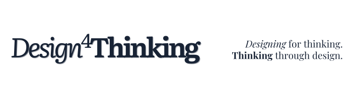

## Pare de Desperdiçar Dinheiro com Treinamentos que Não Funcionam  
### A única metodologia que garante implementação de aprendizagem com resultados reais em 3-6 meses.

Você investe em conteúdos excelentes e plataformas modernas, mas os resultados não aparecem. O problema não é o treinamento — é a implementação. Desde 2019, o *Design*⁴*Thinking* transforma equipes técnicas e executivos, com uma abordagem prática que entrega:

- **94% de sucesso** em projetos implementados.  
- **89% de mudanças sustentáveis** após 6 meses.  
- **Capacidade real** transferida para sua equipe.

|                                  |                                                                                                                                                                                                                                                         |
| -------------------------------- | ------------------------------------------------------------------------------------------------------------------------------------------------------------------------------------------------------------------------------------------------------- |
| [**Para designers instrucionais**](Para-Profissionais) | O *Design*4**Thinking** permite explorar desde os fundamentos do pensamento crítico até técnicas avançadas de design instrucional, tornando acessível um conhecimento disperso em diferentes fontes. [Começe por aqui](Para-Profissionais)   |
| [**Para empresas**](Para-Empresas)                | O *Design*4**Thinking** cria soluções que integram o desenvolvimento do pensamento crítico com objetivos claros de performance, oferecendo desde turmas customizadas até programas completos. Descubra [o que podemos fazer](Para-Empresas). |

Para organizações interessadas em elevar o nível de seus treinamentos, trazemos uma metodologia que vai além do design instrucional tradicional. 

O *Design*4**Thinking** ajuda equipes técnicas e executivos a implementar aprendizagem que gera resultado real.

[Agende uma conversa →](Contato) para falarmos sobre seu cenário específico.

>[!info] Sobre o site.
>
>- [[FAQ]]: o que é o *Design*4**Thinking**? Existe embasamento teórico? Aplicação prática?
>- [Como usar esse site](notes/Sobre-site/Como%20usar%20esse%20site.md): o site contém notas, idéias e reflexões organizadas uma rede de conhecimentos profissionals.
>- Criado e desenvolvido por [Lefebvre Saboya](https://llsaboya.com/pt-br/)

