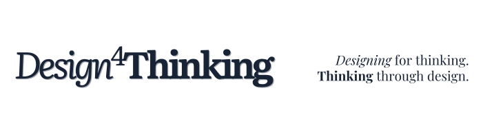

## Aprendizagem organizacional não falha por falta de conteúdo. Falha na implementação.
### Transformamos conhecimento em resultados práticos, mostrando exatamente como fazer a implementação acontecer.

O *Design*4**Thinking** ajuda equipes técnicas e executivos a implementar aprendizagem que gera resultado real desde 2019.

|                                     |                                                                                                                                                                                                                                                              |
| ----------------------------------- | ------------------------------------------------------------------------------------------------------------------------------------------------------------------------------------------------------------------------------------------------------------ |
| **Para designers instrucionais** | O *Design*4**Thinking** permite explorar desde os fundamentos do pensamento crítico até técnicas avançadas de design instrucional, tornando acessível um conhecimento disperso em diferentes fontes. [Começe por aqui](Para-Profissionais)        |
| **Para empresas**                   | O *Design*4**Thinking** cria soluções que integram o desenvolvimento do pensamento crítico com objetivos claros de performance, oferecendo desde turmas customizadas até programas completos. Descubra [o que podemos fazer](Para-Profissionais). |

Para organizações interessadas em elevar o nível de seus treinamentos, trazemos uma metodologia que vai além do design instrucional tradicional. 

Ajudando equipes técnicas e executivos a implementar aprendizagem que gera resultado real desde 2019

[Agende uma conversa →](Contato) para discutir seu desafio específico.

## A verdade incômoda sobre aprendizagem organizacional

>[!warning] Em 5 anos analisando iniciativas de aprendizagem:
>- 82% das organizações têm conteúdo excelente.
>- 76% usam plataformas modernas.
>- 91% contam com equipes engajadas.
>
>Ainda assim, a mudança real de comportamento não acontece.
>
>Por quê? Porque o problema não é conteúdo, tecnologia ou engajamento.
>É implementação.

>[!success] Descobrimos isso depois de:
>- Analisar mais de 100 implementações de aprendizagem.
>- Trabalhar com 47 organizações diferentes.
>- Documentar 286 barreiras de implementação.
>- Desenvolver 12 frameworks práticos.
>
>O resultado? Uma metodologia que funciona no mundo real.

### Nossa Metodologia

Não vendemos teoria. Não prometemos soluções mágicas. Não escondemos nossos métodos.

Compartilhamos exatamente:

*   Como tomamos decisões de implementação.
*   Por que certas abordagens falham.
*   Quando é necessário ajustar o curso.
*   Onde investir recursos escassos.
  
E sim, compartilhamos nossos erros também. Porque fingir que implementação é simples não ajuda ninguém.

>[!note] O que é
>Framework prático que integra:
>- Pensamento crítico estruturado.
>- Design instrucional baseado em evidências.
>- Metodologia de implementação testada.
>- Sistema de medição de resultados.

>[!success] Como funciona
>1. Diagnóstico detalhado da situação atual.
>2. Desenvolvimento do framework de implementação.
>3. Capacitação hands-on da equipe.
>4. Implementação assistida.
>5. Medição e ajustes.
>
>*Duração típica: 3-6 meses*

>[!warning] Por que compartilhamos tudo?
>Acreditamos que valor real não vem de metodologias secretas.
>Vem de capacidade comprovada de implementação.
>
>Por isso mostramos exatamente como fazemos, incluindo:
>- Nossos frameworks completos.
>- Nossas ferramentas de decisão.
>- Nossos erros e aprendizados.

Nossa abordagem nasceu da análise de padrões reais. O que descobrimos:

*   Resistência não se vence com imposição, mas com demonstração prática.
*   Mudança sustentável exige capacidade de implementação distribuída.
*   Métricas precisam fazer sentido tanto para técnicos quanto para executivos.
*   Implementação efetiva depende mais de método do que de motivação.

Como aplicamos:

*   Trabalhamos junto com sua equipe por 3-6 meses.
*   Implementamos projetos reais da sua organização.
*   Transferimos capacidade real de execução.
*   Medimos resultados com transparência total.

>[!sucess] Não terceirizamos implementação. Desenvolvemos sua capacidade de implementar.

## Resultados que podemos provar

>[!example] Nos últimos 12 meses:
>- 94% dos projetos implementados alcançaram as metas estabelecidas.
>- 89% das mudanças continuam sustentáveis após 6 meses.
>- 82% das equipes desenvolveram capacidade autônoma de implementação.
>- 77% das organizações expandiram o modelo para outras iniciativas.

>[!tip] E quando não alcançamos as metas?
>Documentamos exatamente o que deu errado e por quê.
>Porque aprendemos tanto com falhas quanto com sucessos.

## Pronto para implementação que funciona?

Se você:

*   Tem conteúdo de qualidade mas luta com a implementação.
*   Busca mudança real de comportamento, não apenas métricas de LMS.
*   Quer desenvolver capacidade interna de execução.
*   Valoriza transparência e resultados práticos.

Podemos ajudar.

[Agende uma conversa →](Contato) para discutir seu desafio específico.

>[!info] Sobre o site.
>
>- [[FAQ]]: o que é o *Design*4**Thinking**? Existe embasamento teórico? Aplicação prática?
>- [Como usar esse site](notes/Sobre-site/Como%20usar%20esse%20site.md): o site contém notas, idéias e reflexões organizadas uma rede de conhecimentos profissionals.
>- Criado e desenvolvido por [Lefebvre Saboya](https://llsaboya.com/pt-br/)

